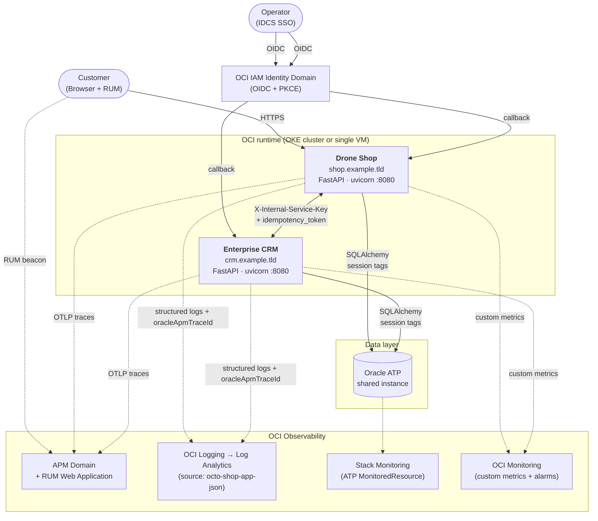

# Platform Architecture — Unified Deploy

`octo-apm-demo` is a unified OCI observability reference platform.
Two application services on top of an OCI 360 runtime: a central OTel
collector, named workload profiles, real browser journeys, async
processing, cache, object-pipeline, edge gateway, stress labs, and
alarm-driven remediation.

## Application tier

- **Drone Shop** (`shop/`) — storefront + checkout + AI assistant
- **Enterprise CRM Portal** (`crm/`) — catalog ownership + CRM ops +
  chaos controller

## Platform services (OCI 360)

11 supporting services + labs. Full inventory:
[site/architecture/service-inventory.md](site/architecture/service-inventory.md).

Summary:

| Tier | Services |
|---|---|
| Telemetry backbone | `octo-otel-gateway` |
| Control plane | `octo-load-control`, `octo-remediator` |
| Edge | `octo-edge-gateway` (OCI API GW + WAF), `octo-edge-fuzz` |
| Runtime expansion | `octo-async-worker`, `octo-cache`, `octo-object-pipeline`, `octo-browser-runner` |
| Labs | `octo-container-lab` (K8s stress Jobs), `octo-vm-lab` (systemd stress-ng) |
| Tooling | `octo-traffic-generator`, `octo-wizard`, `deploy/verify.sh`, workshop verifiers |

## Topology

## Cross-service contract (pinned)

| Concern | Value |
|---|---|
| Shop URL env (on CRM) | `SERVICE_SHOP_URL` (legacy aliases accepted + deprecation-logged) |
| CRM URL env (on Shop) | `SERVICE_CRM_URL` (legacy aliases accepted + deprecation-logged) |
| Auth header | `X-Internal-Service-Key` on every cross-service POST when `INTERNAL_SERVICE_KEY` is configured |
| Order dedup keys | `source_system`, `source_order_id`, `idempotency_token` (UUID5 — stable per `(order_id, source)` via fixed namespace UUID) |
| Discovery | `GET /api/integrations/schema` on both services returns OpenAPI 3.1 subset |

Regression tests on both sides lock this contract:
`shop/tests/test_crm_sync_order_auth.py` +
`shop/tests/test_integration_schema_endpoint.py` +
`crm/tests/test_orders_auth_and_idempotency.py` +
`crm/tests/test_service_shop_url_alias.py`.

## Deployment Bill of Materials

See [deploy/BOM.md](deploy/BOM.md). Summary:

| Category | Items |
|---|---|
| Operator CLIs | oci, kubectl, terraform (≥1.6), docker, envsubst, jq, python3, gh |
| Tenancy | Tenancy OCID, region, Object Storage namespace |
| Compartment + IAM | 1 compartment, 2 dynamic groups, ≥1 policy, IDCS domain + app |
| Network | VCN + public LB subnet + private worker subnet + IG + NAT GW |
| Database | 1 ATP + wallet + 2 passwords |
| Container registry | 2 OCIR repos (shop, CRM) |
| Observability | APM Domain, RUM app, 2 data keys, Log group + log, LA namespace + log group, LA source, Service Connector, Stack Monitoring MonitoredResource |
| WAF | 4 policies + log group + 4 per-frontend logs |
| DNS + TLS | 2 A records + certs |
| Secrets | 9 (auth, internal-service-key, db passwords, wallet, IDCS, APM keys) |
| Runtime | OKE cluster **or** 1 Compute VM |
| Images | shop + CRM |

Smallest viable deploy: **~15 minutes** with the unified VM path.
Full production deploy: **45–90 minutes** first time, ~15 minutes per
subsequent tenancy via the Resource Manager stack.

## Provisioning & portability artifacts

| File | Responsibility |
|---|---|
| `deploy/pre-flight-check.sh` | Fail fast on missing env vars + placeholder leaks (`example.cloud`, `example.invalid`) |
| `deploy/init-tenancy.sh` | Idempotent bootstrap: OCIR repo, K8s namespace, initial Secrets |
| `deploy/resource-manager/` | OCI Resource Manager stack (APM + RUM + LA + WAF) — one-click Console deploy |
| `deploy/vm/` | Single-VM unified install (docker-compose + nginx + systemd + cloud-init) |
| `deploy/k8s/{shop,crm}/` | OKE manifests split by service so rollouts stay independent |
| `deploy/terraform/modules/apm_domain/` | APM Domain + RUM WEB_APPLICATION config |
| `deploy/terraform/main.tf` (`la_pipeline_app_logs`) | Service Connector: `OCI_LOG_ID` → OCI Log Analytics |
| `deploy/oci/ensure_apm.sh` | Wraps terraform plan/apply; emits `export OCI_APM_*` |
| `deploy/oci/ensure_stack_monitoring.sh` | Register ATP as Stack Monitoring MonitoredResource |
| `deploy/k8s/shop/secret-provider-class.yaml` | OCI Vault → pod via Secrets Store CSI (template) |

## Shop-specific architecture

Detailed shop runtime diagram + ERD: [shop/ARCHITECTURE.md](shop/ARCHITECTURE.md).

## CRM-specific architecture

Detailed CRM correlation contract + chaos admin: [crm/docs-site/architecture.md](crm/docs-site/architecture.md)
(also rendered under the Enterprise CRM → Architecture section on the docs site).
