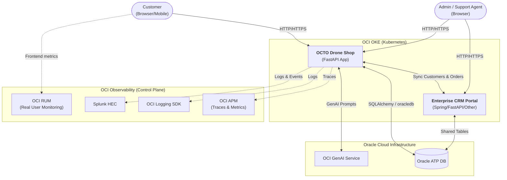

# OCTO Drone Shop Architecture

This document describes the high-level architecture of the OCTO Drone Shop application, its integrations with external systems (like the Enterprise CRM Portal), and its database schema.

## High-Level System Architecture

The OCTO Drone Shop is a cloud-native e-commerce portal built using FastAPI. It operates alongside the `enterprise-crm-portal` and relies heavily on the Oracle Cloud Infrastructure (OCI) stack for observability and data persistence.

## Database Entity-Relationship Diagram (ERD)

The Drone Shop application and the Enterprise CRM Portal share the same backend database (Oracle ATP). The following ERD highlights the tables created by the drone shop (`db_init.sql`) and their relationships.

```mermaid
erDiagram
    users {
        int id PK
        string username
        string email
        string password_hash
        string role
        boolean is_active
        datetime last_login
        datetime created_at
    }

    products {
        int id PK
        string name
        string sku
        string description
        float price
        int stock
        string category
        string image_url
        boolean is_active
        datetime created_at
    }

    customers {
        int id PK
        string name
        string email
        string phone
        string company
        string industry
        float revenue
        string notes
        datetime created_at
        datetime updated_at
    }

    orders {
        int id PK
        int customer_id FK
        float total
        string status
        string payment_method
        string payment_status
        string notes
        string shipping_address
        datetime created_at
    }

    order_items {
        int id PK
        int order_id FK
        int product_id FK
        int quantity
        float unit_price
    }

    shops {
        int id PK
        string name
        string address
        string coordinates
        string contact_email
        string contact_phone
        boolean is_active
        datetime created_at
    }

    cart_items {
        int id PK
        string session_id
        int product_id FK
        int quantity
        datetime created_at
    }

    reviews {
        int id PK
        int product_id FK
        int customer_id FK
        int rating
        string comment
        string author_name
        datetime created_at
    }

    coupons {
        int id PK
        string code
        float discount_percent
        float discount_amount
        boolean is_active
        int max_uses
        int used_count
        datetime created_at
    }

    shipments {
        int id PK
        int order_id FK
        string tracking_number
        string carrier
        string status
        string origin_region
        string destination_region
        float weight_kg
        float shipping_cost
        datetime estimated_delivery
        datetime created_at
    }

    warehouses {
        int id PK
        string name
        string region
        string address
        int capacity
        int current_stock
        boolean is_active
        datetime created_at
    }

    campaigns {
        int id PK
        string name
        string campaign_type
        string status
        float budget
        float spent
        string target_audience
        datetime start_date
        datetime end_date
        datetime created_at
    }

    leads {
        int id PK
        int campaign_id FK
        string email
        string name
        string source
        string status
        int score
        string notes
        datetime created_at
    }

    page_views {
        int id PK
        string page
        string visitor_ip
        string visitor_region
        string user_agent
        int load_time_ms
        string referrer
        string session_id
        datetime created_at
    }

    audit_logs {
        int id PK
        int user_id FK
        string action
        string resource
        string details
        string ip_address
        string trace_id
        datetime created_at
    }

    services {
        int id PK
        string name
        string sku
        string description
        float price
        string category
        string image_url
        boolean is_active
        datetime created_at
    }

    tickets {
        int id PK
        int customer_id FK
        string title
        string status
        string priority
        int product_id FK
        int service_id FK
        datetime created_at
        datetime updated_at
    }

    ticket_messages {
        int id PK
        int ticket_id FK
        string sender_type
        string content
        datetime created_at
    }

    %% Relationships
    customers ||--o{ orders : "places"
    orders ||--|{ order_items : "contains"
    products ||--o{ order_items : "included in"

    customers ||--o{ reviews : "writes"
    products ||--o{ reviews : "receives"

    products ||--o{ cart_items : "added to"

    orders ||--o{ shipments : "tracked by"

    campaigns ||--o{ leads : "generates"

    users ||--o{ audit_logs : "performs (optional)"

    customers ||--o{ tickets : "opens"
    products ||--o{ tickets : "related to (optional)"
    services ||--o{ tickets : "related to (optional)"
    tickets ||--|{ ticket_messages : "contains"
```

