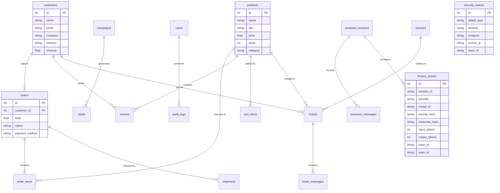

# Data Model

The Drone Shop and Enterprise CRM Portal share the same Oracle ATP instance. Tables are organized by domain.

## Table Organization

### Core
`users`, `products`, `customers`, `orders`, `order_items`, `shops`

### Commerce
`cart_items`, `reviews`, `coupons`, `shipments`, `warehouses`

### Marketing
`campaigns`, `leads`

### Operations
`page_views`, `audit_logs`, `security_events`, `services`, `tickets`, `ticket_messages`

### AI Assistant
`assistant_sessions`, `assistant_messages`, `llmetry_events`

### Workflow Gateway
`workflow_runs`, `query_executions`, `component_snapshots`

## Entity-Relationship Diagram

## Database Observability

| Feature | How |
|---|---|
| Session tagging | `MODULE=octo-drone-shop`, `ACTION=<span_name>`, `CLIENT_IDENTIFIER=<trace_id>` |
| SQL ID enrichment | Oracle SQL_ID computed and attached to APM spans |
| DB Management | Performance Hub shows SQL execution from the app |
| Operations Insights | SQL Warehouse aggregates query patterns |
| Query instrumentation | SQLAlchemy events capture statement, execution time, row count |
