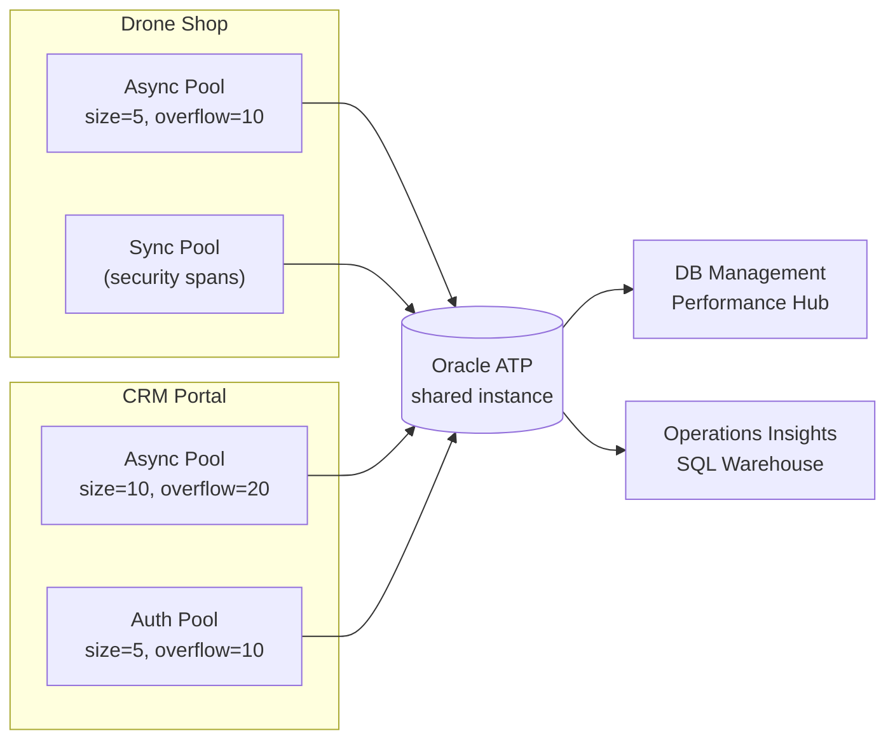
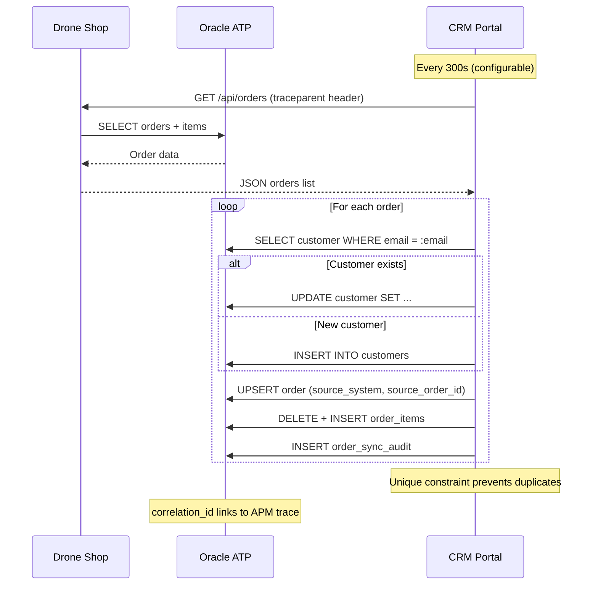

# Database Integration

Both services share a single Oracle ATP instance with wallet-based mTLS authentication. This enables cross-service data correlation while maintaining service independence.

## Connection Architecture



### Connection Pools

| Service | Pool | Size | Max | Purpose |
|---|---|---|---|---|
| Drone Shop | Main async | 5 | 15 | All HTTP route handlers |
| Drone Shop | Sync | 5 | 15 | Security event persistence |
| CRM Portal | Main async | 10 | 30 | HTTP routes + background tasks |
| CRM Portal | Auth sync | 5 | 15 | Session validation (bounded) |

**Total ATP sessions**: Up to 75 per replica pair (2 shop + 1 CRM)

## Shared Tables

Both services use **identical schemas** for core tables:

| Table | Drone Shop | CRM | Sync Direction |
|---|---|---|---|
| `customers` | Checkout creates | Seed + synced | CRM ← Shop |
| `products` | 56 drone products | 12 CRM products | Independent SKU ranges |
| `orders` | Checkout creates | Synced + local | CRM ← Shop (one-way) |
| `order_items` | Via checkout | Via sync | CRM ← Shop |
| `shipments` | Via checkout | Via order sync | CRM ← Shop |
| `warehouses` | 4 regions | 7 regions | Independent |
| `campaigns` | 4 campaigns | 6 campaigns | Independent |
| `leads` | 6 leads | 10 leads | Independent |
| `page_views` | Analytics | Analytics | Independent |
| `audit_logs` | All requests | All requests | Append-only |

## Service-Exclusive Tables

=== "Drone Shop Only"

    | Table | Purpose |
    |---|---|
    | `services` | Professional services catalog |
    | `tickets` / `ticket_messages` | Support system |
    | `cart_items` | Session-based shopping cart |
    | `reviews` | Product ratings |
    | `coupons` | Discount codes |
    | `security_events` | Attack detection records |
    | `assistant_sessions` / `assistant_messages` | GenAI chat |
    | `shops` | Dealer locations |

=== "CRM Only"

    | Table | Purpose |
    |---|---|
    | `user_sessions` | ATP-backed session store (OKE replica sharing) |
    | `order_sync_audit` | Sync event audit trail |
    | `support_tickets` | CRM help desk |
    | `invoices` | Billing documents |
    | `reports` | Custom report definitions |

## Order Sync Data Flow



### Sync Metadata

Orders synced from Drone Shop carry extra CRM columns:

```sql
-- CRM order columns for sync tracking
source_system       VARCHAR2(50)   -- 'octo-drone-shop'
source_order_id     NUMBER         -- Shop order ID
source_customer_email VARCHAR2(255) -- Normalized email
sync_status         VARCHAR2(50)   -- 'synced' | 'failed' | 'local'
backlog_status      VARCHAR2(50)   -- 'backlog' | 'current'
sync_error          VARCHAR2(4000) -- Error message if failed
source_payload      CLOB           -- Original JSON (audit)
correlation_id      VARCHAR2(64)   -- W3C trace ID
last_synced_at      TIMESTAMP
```

## Oracle Session Tagging

Both services tag Oracle sessions for OPSI/DB Management correlation:

```sql
-- Set on pool checkout
DBMS_APPLICATION_INFO.SET_MODULE('octo-drone-shop', 'POST /api/shop/checkout');
DBMS_SESSION.SET_IDENTIFIER('<trace_id>');

-- Result in V$SESSION
MODULE           = 'octo-drone-shop'
ACTION           = 'POST /api/shop/checkout'
CLIENT_IDENTIFIER = '79c76c8173b086043b36e60422a2b317'
```

This enables:
- **DB Management** → Performance Hub → filter by MODULE to see per-service SQL
- **OPSI** → SQL Warehouse → filter by MODULE to see query patterns
- **APM** → Trace Explorer → click SQL span → see DbOracleSqlId → jump to Performance Hub

## SQL ID Computation

Both services compute Oracle-compatible SQL_IDs for APM → OPSI bridging:

```python
# MD5(sql + '\0') → last 8 bytes → base-32 (Oracle alphabet)
# Result: 13-char SQL_ID matching V$SQL.SQL_ID
```

Span attribute `DbOracleSqlId` enables clicking a SQL span in APM Trace Explorer and jumping directly to the matching query in DB Management Performance Hub.
