# Framework Approach

The OCTO Drone Shop is built as a **modular framework** — each feature is an independent module that plugs into shared infrastructure. New capabilities can be added without modifying or risking existing ones.

## Module Architecture

```mermaid
flowchart TD
    subgraph Middleware ["Shared Middleware Stack"]
        Tracing["TracingMiddleware<br/>(outermost)"]
        Metrics["MetricsMiddleware"]
        Chaos["ChaosMiddleware"]
        Geo["GeoLatencyMiddleware"]
    end

    subgraph Modules ["Feature Modules (Independent)"]
        Shop["shop.py<br/>Storefront + Checkout"]
        Orders["orders.py<br/>Cart + Order History"]
        Auth["auth.py<br/>Local Auth"]
        SSO["sso.py<br/>IDCS OIDC"]
        Catalogue["catalogue.py<br/>Products"]
        Shipping["shipping.py<br/>Shipments"]
        Analytics["analytics.py<br/>Insights"]
        Campaigns["campaigns.py<br/>Marketing"]
        Admin["admin.py<br/>User Mgmt"]
        Simulation["simulation.py<br/>Chaos Controls"]
        Integrations["integrations.py<br/>CRM Sync"]
        Services["services.py<br/>Support"]
        ObsDashboard["observability_dashboard.py<br/>360 Monitoring"]
    end

    subgraph Shared ["Shared Services"]
        OTel["otel_setup.py<br/>Tracer + Instrumentors"]
        LogSDK["logging_sdk.py<br/>OCI Logging + Splunk"]
        MetricsPub["oci_monitoring.py<br/>Custom Metrics"]
        SecuritySpans["security_spans.py<br/>MITRE/OWASP"]
        CircuitBreaker["circuit_breaker.py<br/>Resilience"]
        DB["database.py<br/>SQLAlchemy Engines"]
    end

    Tracing --> Metrics --> Chaos --> Geo
    Geo --> Modules
    Modules --> Shared
```



## Adding a New Module

Every module follows the same pattern. To add a new capability:

### 1. Create the Module File

```python
# server/modules/my_feature.py
from fastapi import APIRouter
from server.observability.otel_setup import get_tracer
from server.observability.logging_sdk import push_log
from server.database import get_db

router = APIRouter(prefix="/api/my-feature", tags=["my-feature"])

@router.get("/items")
async def list_items():
    tracer = get_tracer()
    with tracer.start_as_current_span("my_feature.list_items") as span:
        async with get_db() as db:
            # Your logic here
            result = await db.execute(text("SELECT ..."))
            items = [dict(row) for row in result.mappings().all()]

        span.set_attribute("my_feature.item_count", len(items))
        push_log("INFO", "Items listed", **{"my_feature.count": len(items)})
        return {"items": items}
```

### 2. Register the Router

```python
# server/main.py — add two lines:
from server.modules.my_feature import router as my_feature_router
app.include_router(my_feature_router)
```

### 3. What You Get Automatically

By following this pattern, your new module **automatically** receives:

| Capability | How | No Extra Code |
|---|---|---|
| **Distributed tracing** | TracingMiddleware wraps every request | Spans appear in OCI APM |
| **HTTP RED metrics** | MetricsMiddleware counts requests/errors/duration | Prometheus + OCI Monitoring |
| **Structured logging** | `push_log()` adds trace correlation | OCI Logging + Splunk + Log Analytics |
| **Error handling** | Global exception handler catches unhandled errors | Opaque 500 in production |
| **CORS** | CORSMiddleware applies configured origins | No per-module config |
| **Chaos testing** | ChaosMiddleware can inject failures | Simulation controls apply |
| **Geo latency** | GeoLatencyMiddleware simulates regional latency | IP-based simulation |
| **Security spans** | `security_span()` helper for attack detection | MITRE + OWASP classification |
| **Circuit breaker** | Import and use `crm_breaker` or create new breaker | Cascading failure protection |
| **Audit logging** | Middleware auto-populates audit_logs table | Every request audited |

### 4. Module Dependency Graph

```
/api/modules → returns the full module dependency graph
```

Each module declares its `related_to` modules, enabling the frontend to render a dependency visualization.

## Design Rules

!!! warning "Don't Break the Framework"

    1. **Never modify shared middleware** to add module-specific logic
    2. **Never import between modules** — use shared services instead
    3. **Always use `get_tracer()`** for spans — never create standalone tracers
    4. **Always use `push_log()`** for external logging — never use `print()` or raw `logging`
    5. **Always use `get_db()`** context manager — never create standalone DB sessions

## Existing Modules

| Module | Prefix | Routes | Dependencies |
|---|---|---|---|
| `shop` | `/api/shop` | 8 | catalogue, orders, coupons, wallet |
| `orders` | `/api` | 6 | catalogue, shipping, customers |
| `catalogue` | `/api` | 5 | products, reviews |
| `shipping` | `/api` | 5 | orders, warehouses |
| `analytics` | `/api/analytics` | 6 | orders, campaigns, page_views |
| `campaigns` | `/api` | 5 | leads, analytics, customers |
| `admin` | `/api/admin` | 3 | users, audit_logs |
| `auth` | `/api/auth` | 2 | users |
| `sso` | `/api/auth/sso` | 4 | users, IDCS |
| `integrations` | `/api/integrations` | 7 | CRM, customers, orders |
| `services` | `/api` | 5 | tickets, customers |
| `simulation` | `/api/simulate` | 5 | dashboard |
| `observability` | `/api/observability` | 4 | all modules |
