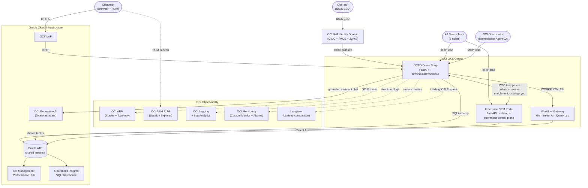
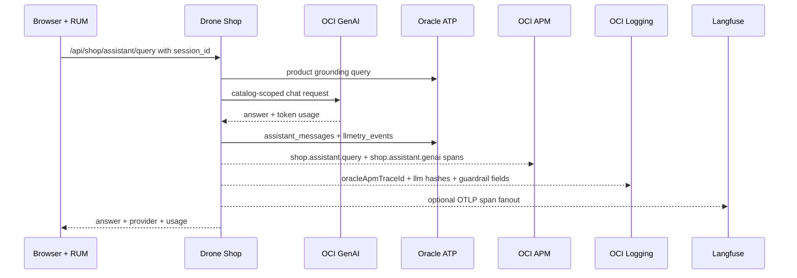

# System Design

## Runtime Topology

The current private demo deployment uses the private Compute topology shown in
the editable DrawIO reference:


Key differences from the older OKE reference below:

- `shop.example.test` and `admin.example.test` are routed by a
  public OCI Load Balancer to private Shop and CRM Compute hosts.
- DNS is owned in the separate external DNS tenancy; private demo owns the LB,
  private VCN, app hosts, ATP, APM, Logging, Cloud Guard, and Log
  Analytics assets.
- The manual HTTPS `443` listener, SSL certificate, and host-routing
  rules are preserved outside normal app delivery until the Terraform
  drift is codified.
- Browser/page traffic still enters through OCI Load Balancer + WAF;
  backend `/api/*` calls are represented behind an OCI API Gateway layer
  for route auth, quotas, access logs, and trace-header preservation.
- Service-to-service calls between Shop, CRM, and the Java app-server
  sidecar are represented through a private API Gateway so component
  boundaries are visible in APM/logging.
- The Shop host runs the optional Java app-server sidecar so checkout,
  payment simulation, SQL error simulation, JVM metrics, and App Servers
  details are all tied to the same APM domain.
- The Shop assistant uses OCI GenAI when configured and emits LLMetry fields
  that fan out to OCI APM, OCI Logging, ATP `llmetry_events`, and optional
  Langfuse OTLP export.

The historical OKE topology remains supported for other deployment
paths:



## Cross-Service Integration

The Drone Shop and Enterprise CRM Portal communicate via HTTP with automatic W3C `traceparent` header injection. In the reference picture those east-west calls pass through a private API Gateway so route policy, service authentication, latency, and failure telemetry can be observed separately from the app spans. Every cross-service call creates a distributed trace visible in OCI APM Topology.

```
Drone Shop ── W3C traceparent ──► Private API Gateway ──► Enterprise CRM
     │                                  │                         │
     │                                  └──► Java app-server      │
     │                                      payment/quote APIs    │
     ├──────────────► OCI GenAI (assistant chat)                  │
     └──────────────► Oracle ATP ◄────────────────────────────────┘
                     (orders, assistant_messages, llmetry_events)
```

## Assistant LLMetry Flow



## Operational Ownership

- **Shop** owns customer browsing, cart state, checkout, order origination, and storefront-side observability.
- **CRM** owns customer operations, invoices, support workflows, storefront metadata, and catalog inventory updates.
- **Oracle ATP** remains the shared persistence layer, which is why topology, traces, and SQL drill-down continue to show both services against the same database.
- **Public CRM links** use `CRM_PUBLIC_URL=https://crm.example.test`; private cluster-local CRM hostnames are intentionally kept out of browser-facing responses.

### Integration Endpoints

| Endpoint | Direction | Purpose |
|---|---|---|
| `/api/integrations/crm/sync-customers` | Shop → CRM | Pull customers into local DB |
| `/api/integrations/crm/sync-order` | Shop → CRM | Push orders as CRM tickets |
| `/api/integrations/crm/customer-enrichment` | Shop → CRM | Enrich local customer profile |
| `/api/integrations/crm/health` | Shop → CRM | Health check with distributed trace |
| CRM product/shop sync → shop catalog | CRM → Shop | Publish CRM-managed product and storefront changes into the shop |
| Simulation proxy | CRM → Shop | Chaos control via `X-Internal-Service-Key` |

## IDCS SSO Flow

```
Browser → /api/auth/sso/login → IDCS /oauth2/v1/authorize (PKCE S256)
     ◄── redirect with code ──
Browser → /api/auth/sso/callback → IDCS /oauth2/v1/token
     → verify ID token via JWKS (/admin/v1/SigningCert/jwk)
     → upsert local user → issue HMAC bearer token → httpOnly cookie
```

- **PKCE** (S256) prevents authorization code interception
- **JWKS** cached 1 hour with auto-refetch on key rotation
- SSO users auto-provisioned on first login
- Password-based users coexist with SSO users

## APM Topology

When all services are deployed, OCI APM Topology shows:

```
Browser (RUM) → Drone Shop → Oracle ATP
                    ├──→ Enterprise CRM → Oracle ATP
                    ├──→ OCI GenAI
                    ├──→ Langfuse (optional OTLP comparison)
                    └──→ IDCS (SSO login spans)
```

Each edge is a real distributed trace. Clicking an edge in APM Topology shows the specific spans crossing that boundary.
