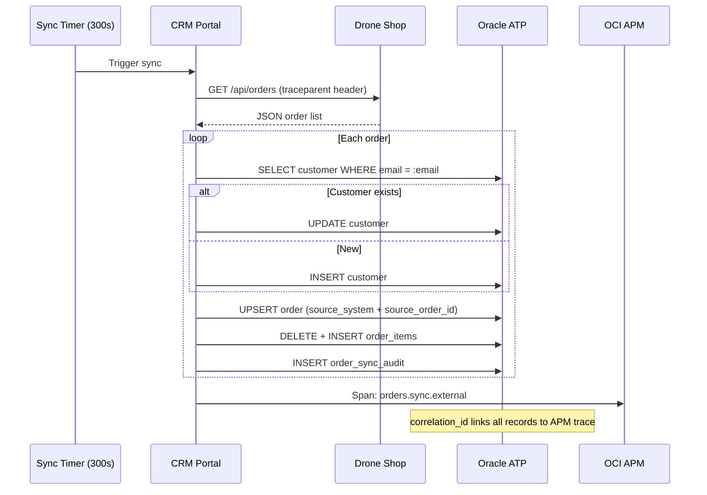

# Order Sync

One-way order synchronization from Drone Shop to CRM Portal, with full audit trail and trace correlation.

## Sync Architecture



## Sync Configuration

| Variable | Default | Purpose |
|---|---|---|
| `ORDERS_SYNC_ENABLED` | true | Enable/disable sync |
| `ORDERS_SYNC_INTERVAL_SECONDS` | 300 | Sync frequency |
| `EXTERNAL_ORDERS_URL` | from `OCTO_DRONE_SHOP_URL` | Source URL |
| `EXTERNAL_ORDERS_PATH` | `/api/orders` | API path |
| `SUSPICIOUS_ORDER_TOTAL_THRESHOLD` | 50000 | Alert threshold |
| `BACKLOG_ORDER_AGE_MINUTES` | 30 | Stale order threshold |

## Idempotency

Orders are upserted using a unique constraint:

```sql
UNIQUE (source_system, source_order_id)
```

Re-running sync updates existing orders instead of creating duplicates.

## Audit Trail

Every sync operation records in `order_sync_audit`:

| Column | Example |
|---|---|
| `source_system` | `octo-drone-shop` |
| `source_order_id` | `3142` |
| `sync_action` | `created` / `updated` / `failed` |
| `sync_status` | `success` / `error` |
| `correlation_id` | `79c76c8173b086043b36e60422a2b317` |
| `trace_id` | Same as APM trace |

## Security Checks

- **Negative quantity detection** → `ATTACK:MASS_ASSIGNMENT` (critical)
- **Total mismatch** (declared vs computed) → security event logged
- **Invalid order ID** → skipped with audit record
- **Missing customer email** → auto-generated fallback

## Backlog Monitoring

Orders stuck in processing for > 30 minutes are flagged:

```
GET /api/integrations/security/summary
→ { "backlog_orders": 3, "oldest_age_minutes": 45, "high_value_pending": 1 }
```
