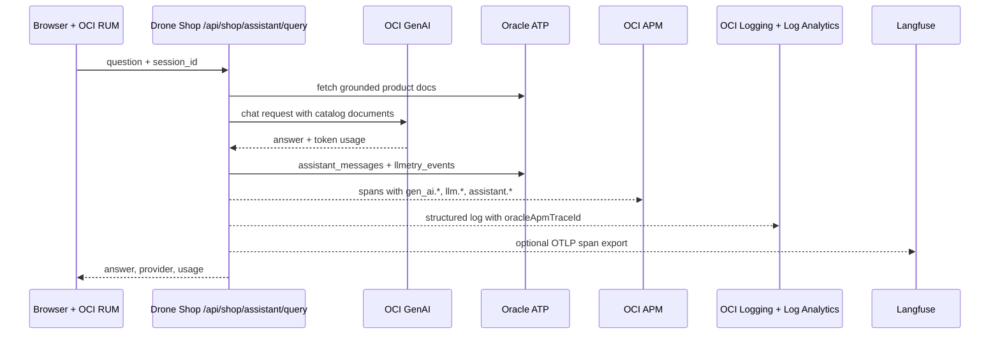

# AI Assistant

OCI GenAI-powered drone advisor with ATP conversation history, product grounding,
and LLMetry correlation across OCI APM, OCI Logging, ATP, and optional
Langfuse.

## How It Works

1. User sends message via `/api/shop/assistant/query`
2. App fetches relevant products from ATP (filtered by `product_focus`)
3. Products converted to grounding documents
4. Message + documents sent to OCI GenAI (or local fallback)
5. Response stored in ATP (`assistant_messages` table)
6. Sanitized LLMetry metadata stored in ATP (`llmetry_events` table)
7. Conversation history maintained per `session_id`

## Configuration

```bash
OCI_GENAI_ENDPOINT="https://inference.generativeai.<region>.oci.oraclecloud.com"
OCI_GENAI_MODEL_ID="cohere.command-r-08-2024"
OCI_COMPARTMENT_ID="<compartment-ocid>"
OCI_AUTH_MODE=instance_principal
LLMETRY_ENABLED=true
LLMETRY_STORE_ENABLED=true
LLMETRY_CAPTURE_CONTENT=false
LANGFUSE_ENABLED=false
LANGFUSE_HOST="https://langfuse.example.test"
LANGFUSE_PROJECT_NAME="drones.octodemo.cloud"
LANGFUSE_PUBLIC_KEY="<project-public-key>"
LANGFUSE_SECRET_KEY="<project-secret-key>"
LANGFUSE_OTEL_EXPORT_ENABLED=true
```

Falls back to local product-matching logic if GenAI is not configured.
Langfuse export is disabled until `LANGFUSE_ENABLED=true` plus host and project
keys are supplied through env vars or `*_FILE` secret mounts.

## API

```
POST /api/shop/assistant/query
{
  "message": "Which drone is best for aerial photography?",
  "session_id": "optional-session-id",
  "product_focus": "camera",
  "customer_email": "optional@example.com"
}
```

## Observability

- Span: `shop.assistant.query` + `shop.assistant.genai`
- Attributes:
  - `assistant.project.name`, `assistant.public_host`, `llmetry.project.name`
  - `assistant.provider`, `assistant.model_id`, `assistant.documents_grounded`
  - `assistant.guardrail.allowed`, `assistant.guardrail.reason`, `assistant.outcome`
  - `llm.prompt.hash`, `llm.response.hash`, `llm.prompt.length`, `llm.response.length`
  - `oci.auth.mode`, `oci.genai.endpoint_host`
  - `gen_ai.request.model`, `gen_ai.response.model`, `gen_ai.usage.input_tokens`, `gen_ai.usage.output_tokens`
  - `langfuse.project.name`, `langfuse.trace.name`, `langfuse.session.id`, `langfuse.observation.type`
- Metrics: `shop.business.assistant.queries`, `shop.business.assistant.latency`, `shop.business.assistant.tokens`, `shop.business.assistant.errors`
- Logs: `Assistant LLMetry observation` records include `oracleApmTraceId`, token counts, hashes, provider, model, session, and guardrail fields.
- ATP rows: `assistant_sessions`, `assistant_messages`, and `llmetry_events` let operators join the conversation record to APM/Logging by `trace_id`.

Raw prompts and responses are not emitted to logs or spans by default. Set
`LLMETRY_CAPTURE_CONTENT=true` only for controlled demos; previews are still
PII-redacted before export.

## Correlation Path


