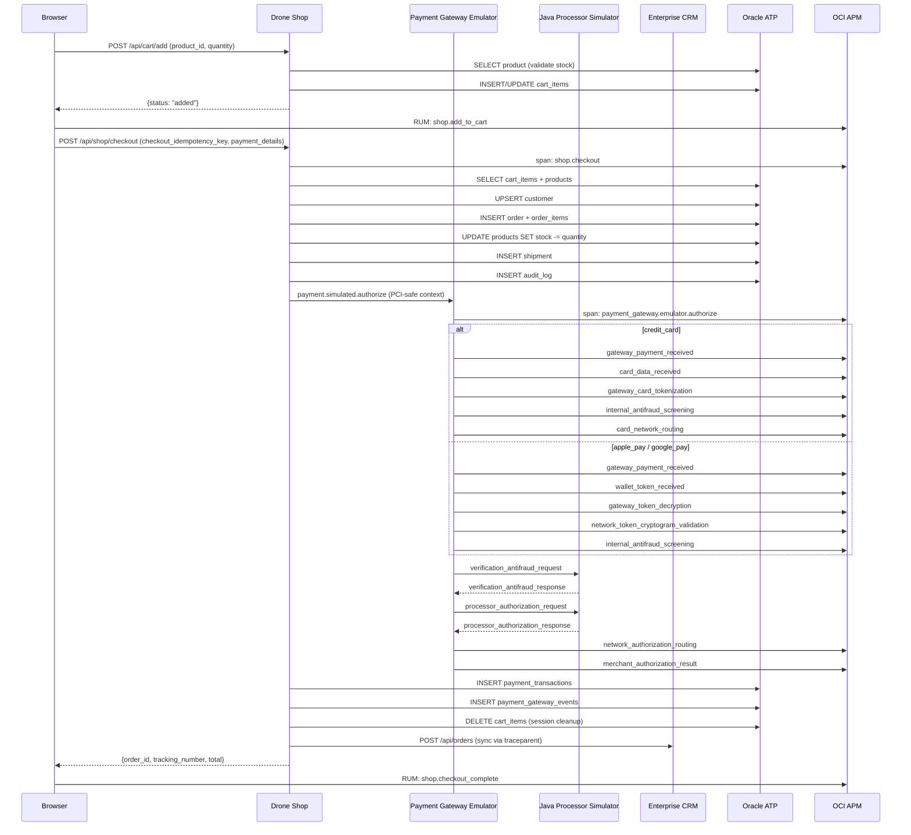

# Checkout Flow

End-to-end order lifecycle from cart to shipment, with full observability at every step.

## Flow



## Pricing Logic

```
subtotal = SUM(price × quantity)
discount = apply_coupon(code, subtotal)
shipping = $0 if subtotal >= $5,000 else $149
total    = max(subtotal - discount, 0) + shipping
```

## Observability at Each Step

| Step | Span | Metrics | Log |
|---|---|---|---|
| Add to cart | `orders.cart.add` | `shop.business.cart.additions` | "Cart updated" |
| Checkout | `shop.checkout` | `shop.business.orders.created` | "Store checkout persisted" |
| Payment gateway | `payment_gateway.emulator.authorize` | `shop.business.payment.authorizations` | "Payment gateway ... request" |
| Wallet/card token | `payment_gateway.<method>.*` | - | `gateway_payment_received`, `card_data_received`, `gateway_card_tokenization`, `wallet_token_received`, `gateway_token_decryption`, `network_token_cryptogram_validation` |
| Antifraud verification | `payment_gateway.<method>.verification_*` | - | Java verification request/response with `payment.verification.decision` |
| Processor hop | `java_app_server.post.api.java-apm.payment.authorize` | `java_app_server` | "Java app-server sidecar call completed" |
| Gateway result | `payment_gateway.<method>.merchant_authorization_result` | - | `payment.gateway.request_id`, status, risk score, and decision source |
| Stock update | (SQLAlchemy auto) | - | - |
| Shipment | (SQLAlchemy auto) | `shop.business.shipments.created` | - |
| CRM sync | `integration.crm.sync_order` | `shop.business.crm.sync` | "Order synced to CRM" |

Payment gateway events are persisted in `payment_gateway_events` with
`trace_id`, `span_id`, `gateway_request_id`, method, network, step name, and
safe metadata. Raw PAN, CVV, and wallet tokens are not logged or persisted.

## Security Checks

| Check | Trigger | Security Span | Log Analytics pivots |
|---|---|---|---|
| Invalid `product_id` | Non-integer | `ATTACK:MASS_ASSIGN` | `Security Check=mass_assign`, `Security Endpoint=/api/cart/add`, `Cart Session ID`, `Trace ID` |
| Quantity > 20 | Rate limit | `ATTACK:RATE_LIMIT` | `Security Check=rate_limit`, `Cart Product ID`, `Cart Quantity`, `Client IP` |
| Missing/inactive product | IDOR attempt | `ATTACK:IDOR` | `Security Check=idor`, `Cart Product ID`, `OWASP Category=A01:2021`, `MITRE Technique ID=T1078` |
| Invalid quantity | Non-integer | `ATTACK:MASS_ASSIGN` | `Security Check=mass_assign`, `Security Product ID`, `Security Session ID`, `Trace ID` |

Each guardrail emits an APM `ATTACK:*` child span, a structured app log with
`oracleApmTraceId`, and a row in `security_events`. The Log Analytics saved
search `checkout-security-checks.sql` groups these real events by check,
endpoint, source IP, product, session, OWASP category, and MITRE technique.

Payment dashboards use real gateway logs and persisted gateway events:

- `payment-gateway-timeline.sql` reconstructs the ordered gateway step
  sequence for a `Payment Gateway Request ID`, trace id, or order id.
- `payment-risk-decisions.sql` groups authorization outcomes by payment
  method, network, wallet/card metadata, verification decision, processor
  decision, and risk score.
- `user-order-action-correlation.sql` joins password-login, checkout, order,
  payment, and guardrail records by authenticated user id, order id, and trace.
- `payment-security-command-center.json` combines payment timeline, payment
  risk, checkout security checks, user/order correlation, and trace drilldown
  widgets.
