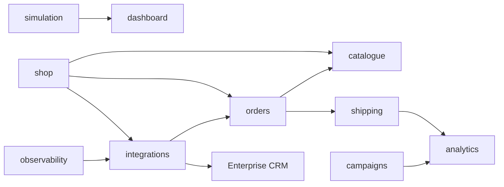

# Drone Shop Modules

13 independent FastAPI router modules, each with dedicated spans, metrics, and error handling.

## Module Map

| Module | Prefix | Routes | Key Functionality |
|---|---|---|---|
| `shop` | `/api/shop` | 8 | Storefront, checkout, coupons, wallet, locations, AI assistant |
| `orders` | `/api` | 6 | Cart CRUD, order creation, order history |
| `catalogue` | `/api` | 5 | Product listing, search, stock management |
| `shipping` | `/api` | 5 | Shipment tracking, carrier status, export |
| `analytics` | `/api/analytics` | 6 | Overview, geo, funnel, security events, correlations |
| `campaigns` | `/api` | 5 | Campaign CRUD, lead management |
| `admin` | `/api/admin` | 3 | User management, audit logs, config |
| `auth` | `/api/auth` | 2 | Local login (HMAC tokens), profile |
| `sso` | `/api/auth/sso` | 4 | IDCS OIDC + PKCE, JWKS verification |
| `integrations` | `/api/integrations` | 7 | CRM sync, enrichment, health, ticket-products |
| `services` | `/api` | 5 | Service catalog, ticket creation, messaging |
| `simulation` | `/api/simulate` | 5 | Chaos controls (SSO-gated) |
| `observability` | `/api/observability` | 4 | 360 dashboard, app/DB/security health |

## Dependency Graph

All modules are independent — they share only the database layer and observability helpers.
