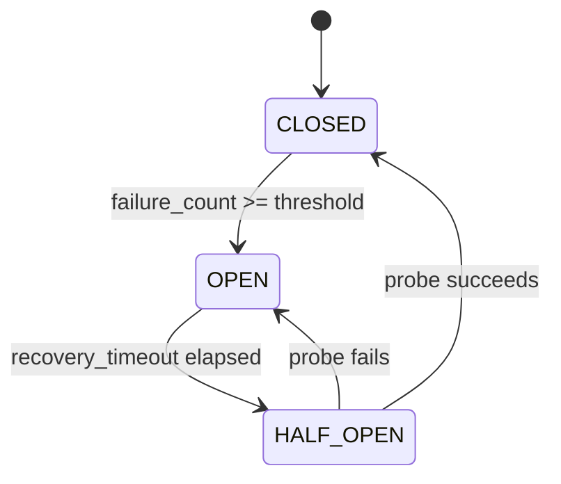

# Circuit Breaker

Prevents cascading failures when integration targets are down.

## How It Works



## Configured Breakers

| Breaker | Failure Threshold | Recovery Timeout | Scope |
|---|---|---|---|
| `crm` | 5 consecutive failures | 60 seconds | All CRM API calls |
| `workflow_gateway` | 3 consecutive failures | 30 seconds | Workflow API calls |

## Observability

Circuit breaker state is tracked in:

- **OTel span attributes** — `integration.circuit_breaker.state` on every CRM call
- **360 dashboard** — `/api/observability/360` → `circuit_breakers` section
- **Integration status** — `/api/integrations/status` → `circuit_breaker` field

## Behavior When Open

When the breaker is OPEN:

- Requests immediately return with `"reason": "circuit breaker OPEN"`
- No HTTP call is made to the target service
- The response includes the breaker status for debugging
- After the recovery timeout, ONE probe request is allowed (HALF_OPEN)
- If the probe succeeds → CLOSED (normal operation)
- If the probe fails → OPEN again (wait another recovery period)

## API Response Example

```json
{
  "configured": true,
  "synced": false,
  "reason": "circuit breaker OPEN (crm)",
  "circuit_breaker": {
    "name": "crm",
    "state": "open",
    "failure_count": 5,
    "failure_threshold": 5,
    "recovery_timeout_s": 60.0,
    "last_failure_age_s": 23.4
  }
}
```
