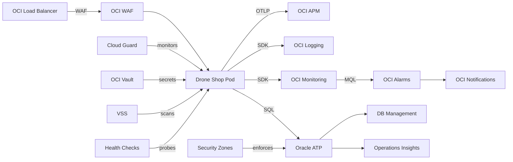

# OCI Services

## Provisioning Scripts

All OCI services are provisioned via idempotent shell scripts in `deploy/oci/`:

| Script | What It Creates |
|---|---|
| `ensure_monitoring.sh` | Notification Topic, Health Check, 5 Alarms |
| `ensure_waf.sh` | WAF Policy with SQLi/XSS/CmdInj/PathTraversal rules + rate limiting |
| `ensure_cloud_guard.sh` | Cloud Guard Target with detector + responder recipes |
| `ensure_security_zones.sh` | Security Zone with compliance recipe |
| `ensure_vault.sh` | OCI Vault + HSM key + secrets |
| `ensure_db_observability.sh` | DB Management + Operations Insights enablement |
| `ensure_atp.sh` | ATP provisioning (idempotent) |

All scripts:

- Check if the resource exists before creating
- Can be run multiple times safely
- Require only `COMPARTMENT_ID` and resource-specific variables

## Service Map

