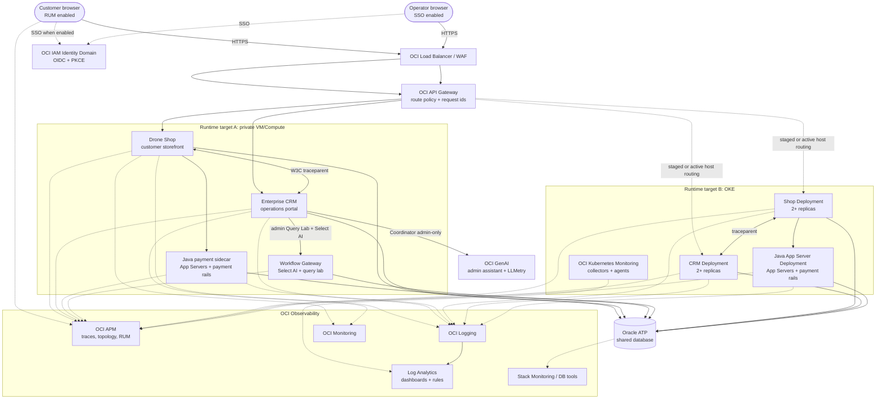

# Platform Overview

OCTO APM Demo consists of a customer storefront, an operations CRM, a Java
payment/app-server sidecar, shared Oracle ATP, and OCI Observability services.
It is a demo project for showing how OCI APM, RUM, Logging, Log Analytics,
Monitoring, Stack Monitoring, WAF, API Gateway, and database tooling connect
around a single business journey.

The current public architecture covers two active runtime targets:

- **Private VM/Compute reference** — private Shop and CRM hosts behind OCI Load
  Balancer/WAF/API Gateway, with a Java sidecar on the app tier.
- **OKE runtime** — the same Shop, CRM, and Java app-server containers running
  as Kubernetes Deployments with Kubernetes observability collectors.

Both runtimes preserve the same signal contract: APM traces/RUM, structured
OCI Logging rows, Log Analytics fields/searches/dashboards, ATP SQL evidence,
and token-safe payment/security pivots. Public docs use placeholders only;
keep tenancy names, OCIDs, private/public IPs, secret paths, and allowlists in
ignored operator notes.

## Published Architecture

[Download editable Platform Overview drawio source](diagrams/platform-overview.drawio)

[Download editable Private Compute drawio source](diagrams/private-demo-observability-reference.drawio)

The published diagrams are sanitized. Keep resolved public IPs, private IPs,
OCIDs, secret paths, and operator allowlists in local-only files that match the
ignored `*with-ips*`, `*resolved*`, or `*.local.*` patterns.

## Runtime Topology

## Repositories

| Repository | Component | Tech | Purpose |
|---|---|---|---|
| [octo-apm-demo](%%GITHUB_REPO_URL%%) | Unified deploy, docs, architecture, OCI assets | Terraform, scripts, MkDocs, OCI CLI helpers | Reusable demo wrapper, public docs, diagrams, APM saved queries, Log Analytics assets. |
| [octo-drone-shop](%%SHOP_REPO_URL%%) | Drone Shop + Workflow Gateway | Python/FastAPI + Go | Customer storefront, checkout, AI assistant, payment telemetry, observability, query surfaces. |
| [enterprise-crm-portal](%%CRM_REPO_URL%%) | Enterprise CRM Portal | Python/FastAPI | CRM operations, storefront/catalog administration, order/customer workflows, simulation lab. |

## Shared Infrastructure

| Resource | Shared by | Purpose |
|---|---|---|
| Oracle ATP | Shop, CRM, Java sidecar, Workflow Gateway | Shared data, SQL visibility, cross-service trace correlation. |
| OCI APM Domain | Browser, Shop, CRM, Java sidecar, Workflow Gateway | Traces, topology, RUM, App Servers, and saved-query drill-downs. |
| OCI Logging and Log Analytics | Application, edge, WAF, OS, and security logs | Parser-backed fields, dashboards, saved searches, scheduled detection rules. |
| OCI IAM Identity Domain | Shop and CRM | OIDC SSO with PKCE and JWKS validation. |
| OCI Monitoring | App hosts and custom app metrics | Health, business metrics, and alarm-ready measurements. |
| OCI WAF / API Gateway | Public and private request paths | Threat controls, route policy, request ids, access logs, and trace-header preservation. |

## Ownership Boundaries

| Domain | System of record | Notes |
|---|---|---|
| Customer browse, cart, checkout | Shop | Customer-facing UI stays free of backend implementation details. |
| Product catalog and storefront administration | CRM | Operators manage products, stock, pricing, category, shop assignment, and storefront metadata. |
| Admin AI, Query Lab, Select AI, and OCI Coordinator | CRM/Admin + Workflow Gateway | Workflow Gateway admin labs require the Admin surface; public storefront hosts are rejected for admin lab browser calls. |
| Payment rail simulation | Shop + Java sidecar | Shop owns checkout orchestration; Java sidecar adds App Servers and payment rail spans using token-safe fields. |
| Orders and customer sync | Shared ATP + CRM workflows | Orders originate in Shop and synchronize into CRM. |
| Observability assets | Unified repo | APM saved queries, Log Analytics fields/parsers/searches/dashboards, diagrams, and docs are versioned here. |

## Supported Deployment Paths

| Path | Use case | Notes |
|---|---|---|
| Private Compute | Current reference demo | Private app hosts behind OCI Load Balancer/WAF/API Gateway with shared ATP and OCI Observability. |
| OKE | Kubernetes workshop or production-style demo | Same application and signal contract, deployed as Shop/CRM/Java Deployments with OCIR images, Kubernetes monitoring collectors, and staged or active LB routing. |
| Single VM | Lightweight workshop | Useful for constrained environments where full OKE is unnecessary. |
| Local stack | Development and regression | Validates docs, tests, and app behavior without publishing tenancy-specific values. |

## Runtime Contract: VM and OKE

| Concern | Private VM/Compute | OKE |
| --- | --- | --- |
| Public entry | OCI Load Balancer + WAF + route policy | Same LB/WAF/API Gateway pattern, with host routing to Kubernetes backends when promoted |
| App runtime | private Compute hosts running containers | Kubernetes Deployments and Services in app namespaces |
| Java App Servers evidence | Java sidecar/service on app tier | Java app-server Deployment, same APM service contract |
| Logs | app JSON, OS/container logs, WAF/API Gateway logs | app JSON, Kubernetes container logs, WAF/API Gateway logs |
| Log Analytics pivots | `Trace ID`, `Order ID`, `Payment Gateway Request ID`, `Attack ID` | same field contract; Kubernetes source names may differ |
| SQL evidence | shared ATP and `DbOracleSqlId` span fields | same ATP and SQL span enrichment |
| Guided demo UX | Admin Simulation Lab + Captured Data Center | same app pages after OKE image rollout |

## Public Documentation Rules

- Use placeholders and variables for tenancy-specific values.
- Link to sanitized SVG previews and editable `.drawio` sources.
- Keep live IPs, OCIDs, private hostnames, credential paths, and allowlists out
  of public docs and public diagram sources.
- Preserve customer-friendly labels in diagrams. Put implementation details in
  architecture pages, not customer-facing frontend views.
