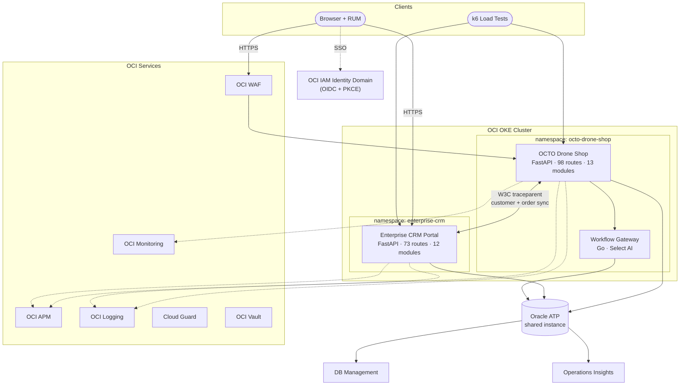

# Platform Overview

The OCTO Cloud-Native Platform consists of two application services sharing a single Oracle ATP database, with full OCI observability stack and cross-service distributed tracing.

## Platform Components

## Repositories

| Repository | Component | Tech | Routes | Purpose |
|---|---|---|---|---|
| [octo-drone-shop](https://github.com/adibirzu/octo-drone-shop) | Drone Shop + Workflow Gateway | Python/FastAPI + Go | 98 + 15 | E-commerce, observability, AI assistant |
| [enterprise-crm-portal](https://github.com/adibirzu/enterprise-crm-portal) | Enterprise CRM Portal | Python/FastAPI | 73 | CRM, security testing, simulation lab |

## Shared Infrastructure

| Resource | Shared By | Purpose |
|---|---|---|
| Oracle ATP | Both services | Single database instance, wallet-based mTLS |
| OCI APM Domain | Both services | Traces, topology, RUM |
| OCI IAM Identity Domain | Both services | OIDC SSO (PKCE + JWKS) |
| OCI Logging | Both services | Structured logs with `oracleApmTraceId` |
| DNS Domain | Both services | `shop.{domain}` + `crm.{domain}` |

## Design Principles

1. **Shared Data, Independent Services** — Both services read/write the same ATP tables but run in separate K8s namespaces with independent deployments
2. **Observability by Default** — Every HTTP request generates traces, logs, and metrics automatically through shared middleware
3. **Tenancy Portable** — Single `DNS_DOMAIN` variable configures both services
4. **Framework Architecture** — New modules can be added to either service without modifying shared infrastructure
5. **Security-Aware** — CRM includes intentional OWASP vulnerabilities for security training; Drone Shop implements production-grade security controls
