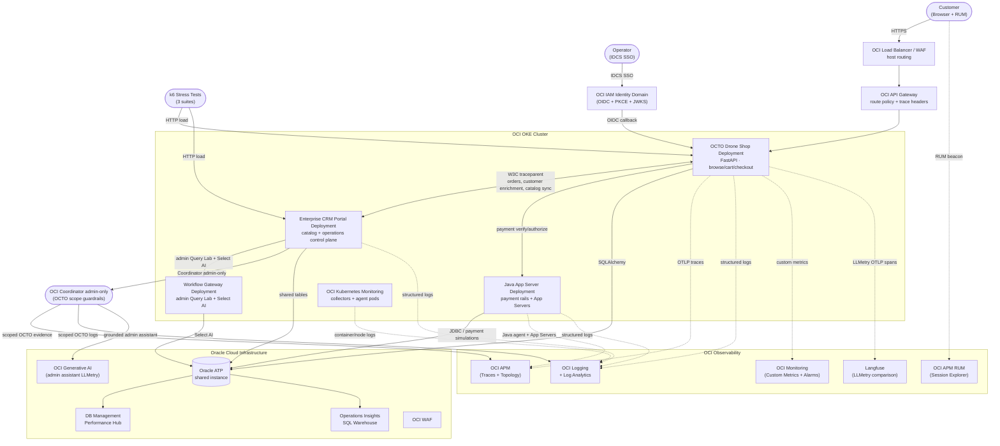
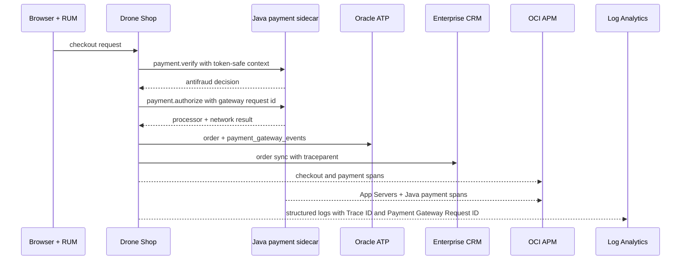
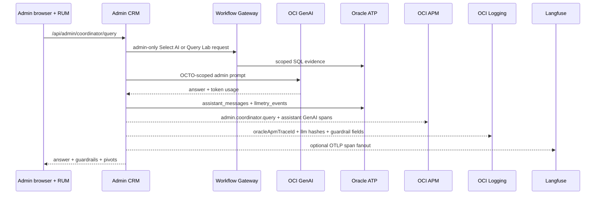

# System Design

## Runtime Topology

The current architecture supports both the private VM/Compute reference runtime
and an OKE runtime. Both use the same application images, ATP schema, APM
domain contract, Log Analytics fields, and event-generation guide. Keep live
tenancy/profile names, public IPs, private IPs, OCIDs, and credential paths out
of this public page.

The private VM/Compute topology is shown in the editable DrawIO reference:


Key VM/Compute characteristics:

- `shop.example.test` and `admin.example.test` are routed by a
  public OCI Load Balancer to private Shop and CRM Compute hosts.
- DNS is owned in the separate external DNS tenancy; private demo owns the LB,
  private VCN, app hosts, ATP, APM, Logging, Cloud Guard, and Log
  Analytics assets.
- The manual HTTPS `443` listener, SSL certificate, and host-routing
  rules are preserved outside normal app delivery until the Terraform
  drift is codified.
- Browser/page traffic still enters through OCI Load Balancer + WAF;
  backend `/api/*` calls are represented behind an OCI API Gateway layer
  for route auth, quotas, access logs, and trace-header preservation.
- Service-to-service calls between Shop, CRM, and the Java app-server
  sidecar are represented through a private API Gateway so component
  boundaries are visible in APM/logging.
- The Shop host runs the optional Java app-server sidecar so checkout,
  payment simulation, SQL error simulation, JVM metrics, and App Servers
  details are all tied to the same APM domain.
- The Shop assistant uses OCI GenAI when configured and emits LLMetry fields
  that fan out to OCI APM, OCI Logging, ATP `llmetry_events`, and optional
  Langfuse OTLP export.

The OKE topology is now an active supported runtime target as well. It keeps the
same Shop, CRM, Java sidecar, ATP, APM, and Log Analytics behavior, but runs the
app tier as Kubernetes Deployments and uses Kubernetes monitoring collectors for
container and node evidence:



## Cross-Service Integration

The Drone Shop and Enterprise CRM Portal communicate via HTTP with automatic W3C `traceparent` header injection. In the reference picture those east-west calls pass through a private API Gateway so route policy, service authentication, latency, and failure telemetry can be observed separately from the app spans. Every cross-service call creates a distributed trace visible in OCI APM Topology.

```
Drone Shop ── W3C traceparent ──► Private API Gateway ──► Enterprise CRM
     │                                  │                         │
     │                                  └──► Java app-server      │
     │                                      payment/quote APIs    │
     ├──────────────► Admin CRM / Workflow Gateway (Select AI)    │
     └──────────────► Oracle ATP ◄────────────────────────────────┘
                     (orders, assistant_messages, llmetry_events)
```

## Payment Rail Observability

Checkout now includes a token-safe payment gateway simulation and a Java
app-server sidecar. The Shop API orchestrates the customer checkout and calls
the Java sidecar for payment verification and authorization. The Java service
adds OCI APM App Servers visibility and emits payment spans/events for wallet,
3-D Secure, processor, and network authorization steps.



The payload intentionally excludes raw PAN, CVV, wallet token payloads,
cryptograms, customer email, and secrets. Operators pivot with `Trace ID`,
`Order ID`, `Payment Gateway Request ID`, `Transaction ID`, and response-code
fields instead.

## Admin Assistant LLMetry Flow



## Operational Ownership

- **Shop** owns customer browsing, cart state, checkout, order origination, and storefront-side observability.
- **CRM** owns customer operations, invoices, support workflows, storefront metadata, and catalog inventory updates.
- **Oracle ATP** remains the shared persistence layer, which is why topology, traces, and SQL drill-down continue to show both services against the same database.
- **Public CRM links** use `CRM_PUBLIC_URL=https://crm.example.test`; private cluster-local CRM hostnames are intentionally kept out of browser-facing responses.

## Runtime Parity

| Capability | VM/Compute runtime | OKE runtime |
| --- | --- | --- |
| Event generation UI | Admin Simulation Lab and Shop checkout pages | Same app pages after image rollout |
| Captured Data Center | `/captured-data` builds APM and Log Analytics pivots | Same app page and same pivot contract |
| APM service names | Shop, CRM, Java sidecar, Workflow Gateway | OKE service-name variants may be used, with same saved-query intent |
| RUM | Browser agent on Shop/CRM pages | Same browser agent and synthetic-user behavior |
| Logs | app JSON, OS/container, WAF/API Gateway | app JSON, Kubernetes container, WAF/API Gateway |
| Log Analytics | saved searches over `Trace ID`, `Order ID`, `Payment Gateway Request ID`, `Attack ID` | same fields; source names can differ for Kubernetes logs |
| App Servers | Java sidecar agent | Java app-server Deployment agent |
| SQL evidence | SQLAlchemy/JDBC spans and ATP `DbOracleSqlId` | same SQL span enrichment and ATP target |

### Integration Endpoints

| Endpoint | Direction | Purpose |
|---|---|---|
| `/api/integrations/crm/sync-customers` | Shop → CRM | Pull customers into local DB |
| `/api/integrations/crm/sync-order` | Shop → CRM | Push orders as CRM tickets |
| `/api/integrations/crm/customer-enrichment` | Shop → CRM | Enrich local customer profile |
| `/api/integrations/crm/health` | Shop → CRM | Health check with distributed trace |
| CRM product/shop sync → shop catalog | CRM → Shop | Publish CRM-managed product and storefront changes into the shop |
| Simulation proxy | CRM → Shop | Chaos control via `X-Internal-Service-Key` |

## IDCS SSO Flow

```
Browser → /api/auth/sso/login → IDCS /oauth2/v1/authorize (PKCE S256)
     ◄── redirect with code ──
Browser → /api/auth/sso/callback → IDCS /oauth2/v1/token
     → verify ID token via JWKS (/admin/v1/SigningCert/jwk)
     → upsert local user → issue HMAC bearer token → httpOnly cookie
```

- **PKCE** (S256) prevents authorization code interception
- **JWKS** cached 1 hour with auto-refetch on key rotation
- SSO users auto-provisioned on first login
- Password-based users coexist with SSO users

## APM Topology

When all services are deployed, OCI APM Topology shows:

```
Browser (RUM) → Drone Shop → Oracle ATP
                    ├──→ Enterprise CRM → Oracle ATP
                    ├──→ Admin Coordinator → OCI GenAI
                    ├──→ Langfuse (optional OTLP comparison)
                    └──→ IDCS (SSO login spans)
```

Each edge is a real distributed trace. Clicking an edge in APM Topology shows the specific spans crossing that boundary.
