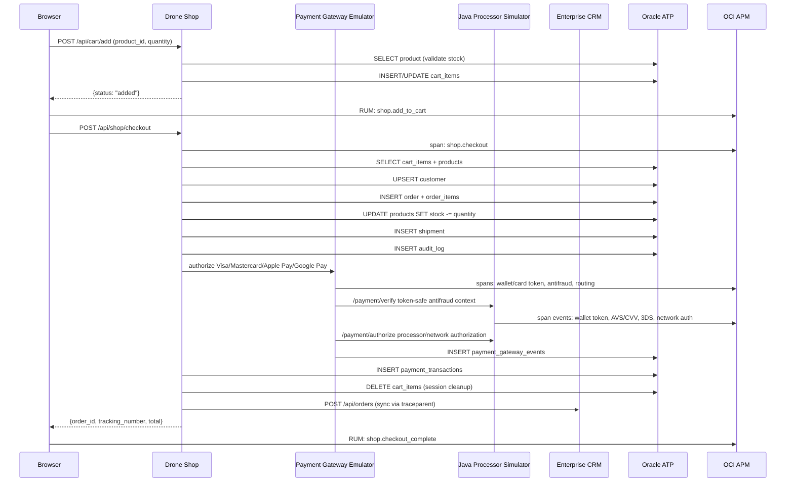

# Checkout Flow

End-to-end order lifecycle from cart to shipment, with full observability at every step.

## Flow



## Idempotency

Browser checkout sends a `checkout_idempotency_key` with each
`POST /api/shop/checkout` attempt. The button is disabled while the request
is in flight, and the backend stores the key on `orders` with a unique
constraint. If a browser retry or duplicate submit repeats the same key,
the API returns the original order with `idempotent_replay=true` instead
of inserting another order.

## Pricing Logic

```
subtotal = SUM(price × quantity)
discount = apply_coupon(code, subtotal)
shipping = $0 if subtotal >= $5,000 else $149
total    = max(subtotal - discount, 0) + shipping
```

## Observability at Each Step

| Step | Span | Metrics | Log |
|---|---|---|---|
| Add to cart | `orders.cart.add` | `shop.business.cart.additions` | "Cart updated" |
| Checkout | `shop.checkout` | `shop.business.orders.created` | "Store checkout persisted" |
| Payment gateway | `payment_gateway.emulator.authorize` | `shop.business.payment.authorizations` | "Payment gateway ... request" |
| Wallet/card token | `payment_gateway.<method>.*` | - | Google Pay `PaymentData`, Apple Pay token, card tokenization logs |
| Verification hop | `java_app_server.post.api.java-apm.payment.verify` | `java_app_server` | "Java app-server sidecar call completed" |
| Processor hop | `java_app_server.post.api.java-apm.payment.authorize` | `java_app_server` | "Java app-server sidecar call completed" |
| Java payment events | `java.payment.*` span events | - | Wallet validation, 3DS, AVS/CVV, response code, network id |
| Stock update | (SQLAlchemy auto) | - | - |
| Shipment | (SQLAlchemy auto) | `shop.business.shipments.created` | - |
| CRM sync | `integration.crm.sync_order` | `shop.business.crm.sync` | "Order synced to CRM" |

Payment gateway events are persisted in `payment_gateway_events` with
`trace_id`, `span_id`, `gateway_request_id`, method, network, step name, and
safe metadata. Raw PAN, CVV, cryptograms, and wallet tokens are not logged or
persisted.

## Payment Rail Simulation

The implementation now matches the architecture diagram: checkout calls a
Python gateway emulator, the gateway calls the Java sidecar for antifraud
verification and processor authorization, and both components stamp the same
`payment.gateway.request_id` so APM, Log Analytics, ATP rows, CRM orders, and
browser RUM events can be joined.

| Rail | Simulated workflow evidence |
|---|---|
| Google Pay | `PaymentData.paymentMethodData.type=CARD`, `tokenizationData.type=PAYMENT_GATEWAY`, gateway merchant hash, token hash, card network, cryptogram validation |
| Apple Pay | merchant validation, payment token envelope, `paymentData.version=EC_v1`, header transaction id hash, payment method network |
| Visa | e-commerce tokenization, Visa Secure 3DS `eci=05`, AVS/CVV result, processor response code, synthetic network transaction id |
| Mastercard | e-commerce tokenization, Mastercard Identity Check 3DS `eci=02`, AVS/CVV result, processor response code, synthetic network transaction id |

Only token-safe fields cross into Java: gateway request id, method,
network, gateway provider, wallet token hash, card brand/last4,
card fingerprint, billing postal-code presence, CVV presence, risk
reasons, and idempotency hash. The Shop Java client also sends
`X-Request-Id`, `X-Workflow-Id=checkout`, and a payment-specific
`X-Workflow-Step` header so Java server spans, Java stdout JSON, Shop
sidecar logs, and APM traces share the same workflow pivots.

Gateway step API responses expose `component`, `component_label`, and
`peer_service` for each safe step. Operators should see labels such as
Google Pay Gateway, Apple Pay Gateway, VISA Payment Network, Mastercard
Payment Network, OCTO Java Payment Processor, and OCTO Antifraud
Verification App without exposing payment secrets.
Operators can inspect the stored gateway timeline through:

```text
GET /api/observability/payment-gateway/events?gateway_request_id=<PGW_REQUEST_ID>
GET /api/observability/payment-gateway/events?trace_id=<TRACE_ID>
GET /api/observability/payment-gateway/events?order_id=<ORDER_ID>
```

The endpoint accepts the same authenticated browser session used by the
admin observability pages, or `X-Internal-Service-Key` for trusted internal
automation. Responses include the persisted step sequence so the payment
view can be correlated with APM spans, application logs, CRM order state, and
Oracle rows.

Login and checkout database evidence share the same user/order relationship:
`auth.login` emits success/failure logs and successful logins insert an
`audit_logs` row with the authenticated `user_id`; checkout-created audit rows
also use the authenticated user id when present. This lets Log Analytics and
ATP queries map login activity to the later order and payment rows.

Orders carry the payment state needed for CRM and support workflows:

| Field | Purpose |
|---|---|
| `payment_gateway_request_id` | Join key for gateway events and processor logs |
| `payment_status` | `pending`, `paid`, `declined`, `failed`, or `requires_payment` |
| `payment_required` | Whether the order still requires customer action |
| `payment_paid_at` | UTC timestamp for approved payments |

The CRM Orders page displays payment status and gateway correlation so a
support operator can start from the order and pivot to the same trace and
gateway event sequence without reading raw payment details.

## Security Checks

| Check | Trigger | Security Span |
|---|---|---|
| Invalid product_id | Non-integer | `ATTACK:MASS_ASSIGN` |
| Quantity > 20 | Rate limit | `ATTACK:RATE_LIMIT` |
| Missing/inactive product | IDOR attempt | `ATTACK:IDOR` |
| Invalid quantity | Non-integer | `ATTACK:MASS_ASSIGN` |
