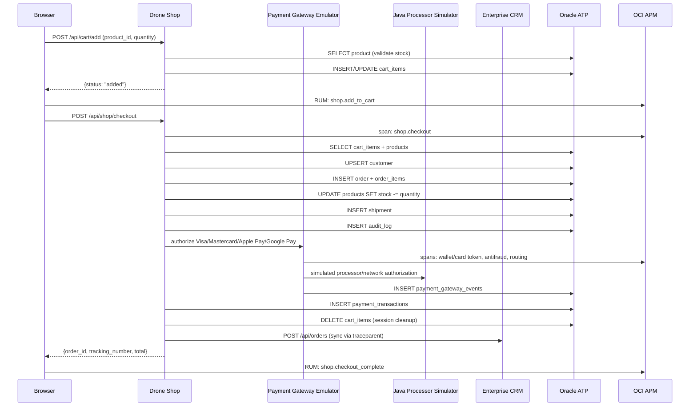

# Checkout Flow

End-to-end order lifecycle from cart to shipment, with full observability at every step.

## Flow



## Idempotency

Browser checkout sends a `checkout_idempotency_key` with each
`POST /api/shop/checkout` attempt. The button is disabled while the request
is in flight, and the backend stores the key on `orders` with a unique
constraint. If a browser retry or duplicate submit repeats the same key,
the API returns the original order with `idempotent_replay=true` instead
of inserting another order.

## Pricing Logic

```
subtotal = SUM(price × quantity)
discount = apply_coupon(code, subtotal)
shipping = $0 if subtotal >= $5,000 else $149
total    = max(subtotal - discount, 0) + shipping
```

## Observability at Each Step

| Step | Span | Metrics | Log |
|---|---|---|---|
| Add to cart | `orders.cart.add` | `shop.business.cart.additions` | "Cart updated" |
| Checkout | `shop.checkout` | `shop.business.orders.created` | "Store checkout persisted" |
| Payment gateway | `payment_gateway.emulator.authorize` | `shop.business.payment.authorizations` | "Payment gateway ... request" |
| Wallet/card token | `payment_gateway.<method>.*` | - | Wallet/card tokenization and cryptogram logs |
| Processor hop | `java_app_server.post.api.java-apm.payment.authorize` | `java_app_server` | "Java app-server sidecar call completed" |
| Stock update | (SQLAlchemy auto) | - | - |
| Shipment | (SQLAlchemy auto) | `shop.business.shipments.created` | - |
| CRM sync | `integration.crm.sync_order` | `shop.business.crm.sync` | "Order synced to CRM" |

Payment gateway events are persisted in `payment_gateway_events` with
`trace_id`, `span_id`, `gateway_request_id`, method, network, step name, and
safe metadata. Raw PAN, CVV, and wallet tokens are not logged or persisted.

## Security Checks

| Check | Trigger | Security Span |
|---|---|---|
| Invalid product_id | Non-integer | `ATTACK:MASS_ASSIGN` |
| Quantity > 20 | Rate limit | `ATTACK:RATE_LIMIT` |
| Missing/inactive product | IDOR attempt | `ATTACK:IDOR` |
| Invalid quantity | Non-integer | `ATTACK:MASS_ASSIGN` |
