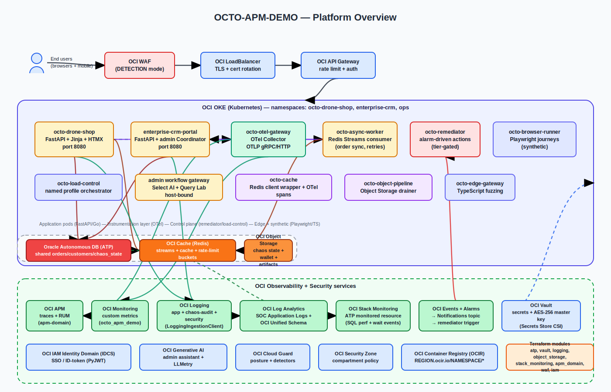
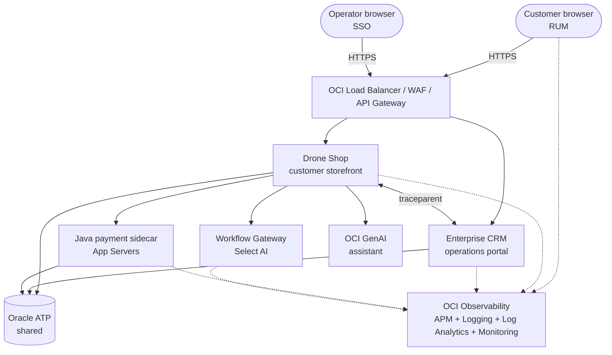

# OCTO APM Demo Platform

An end-to-end OCI Observability reference: distributed tracing, real-user
monitoring, log analytics, custom metrics, and database telemetry — wired
together so every browser click can be followed all the way to an Oracle
Autonomous Database query.

[:material-rocket-launch: Get Started](getting-started/index.md){ .md-button .md-button--primary }
[:material-vector-square: View Architecture](architecture/platform-overview.md){ .md-button }
[:octicons-mark-github-16: Source on GitHub](%%GITHUB_REPO_URL%%){ .md-button }

---

## Choose your path

<div class="grid cards" markdown>

-   :material-eye-outline:{ .lg .middle } **I want to see the demo**

    ---

    Walk through the storyboard: a customer checkout, a failure injection, and
    the full trace + log + metric pivot inside the OCI console.

    [:octicons-arrow-right-24: Demo Storyboard](observability-v2/demo-storyboard-attack-lab.md)

-   :material-server-network:{ .lg .middle } **I want to deploy it**

    ---

    Compute single-VM, OKE with Helm, or local Docker Compose — pick the
    footprint that matches your tenancy and time budget.

    [:octicons-arrow-right-24: Deployment Options](getting-started/deployment-options.md)

-   :material-chart-line:{ .lg .middle } **I want to understand the observability story**

    ---

    Metrics, Events, Logs, Traces, plus Security (MELT-S) — how every signal
    is captured, correlated, and routed through OCI Observability.

    [:octicons-arrow-right-24: MELT-S Overview](observability/melts.md)

-   :material-code-braces:{ .lg .middle } **I want to extend the codebase**

    ---

    Service inventory, data model, correlation contract, and the layered
    architecture diagrams that explain how the pieces fit together.

    [:octicons-arrow-right-24: Architecture](architecture/platform-overview.md)

</div>

---

## What's in the platform

A small constellation of services, each instrumented end-to-end and connected
through one shared trace context:

- **Drone Shop storefront** — FastAPI (Python) customer storefront with browse,
  cart, checkout, AI assistant, and RUM-instrumented browser sessions.
- **Java payment sidecar** — Spring Boot service that adds OCI APM App Servers
  visibility and gateway authorization spans to every checkout trace.
- **Enterprise CRM Portal** — FastAPI (Python) operations portal for catalog,
  order, customer, simulation, and security-training workflows.
- **Workflow Gateway** — Admin labs proxy fronting Select AI and operator-only
  workflow surfaces.
- **Support services** — `async-worker`, `load-control`, `object-pipeline`,
  `remediator`, `edge-fuzz`, and `auto-remediator` for chaos, signal injection,
  and remediation demos.
- **Shared Oracle Autonomous Database (ATP)** — single instance with session
  tagging, SQL_ID bridging, and an idempotency contract for cross-service
  correlation.
- **End-to-end trace context** — browser RUM → FastAPI → Java sidecar → ATP,
  with W3C `traceparent` propagation at every hop.
- **Full OCI Observability surface** — APM, APM RUM, Logging, Logging Analytics,
  Monitoring, Stack Monitoring, and Service Connector Hub.

---

## OCI Observability at a glance

| Signal | OCI Service | What you see |
|---|---|---|
| Distributed traces | **APM** | Span search, trace explorer, dependency map, App Servers view |
| Browser sessions | **APM RUM** | Page loads, custom actions, fetch trace propagation |
| Structured logs | **Logging → Logging Analytics** | Searchable correlated logs with `oracleApmTraceId` |
| Custom metrics | **Monitoring** | Payment success rate, login failures, business KPIs |
| Database health | **Stack Monitoring** | ATP performance, capacity, and SQL pivots |
| Log routing | **Service Connector Hub** | OCI Logging → Log Analytics pipeline |
| Security events | **Cloud Guard + Log Analytics** | Detection rules, attack-lab pivots, WAF evidence |

!!! tip "The correlation promise"
    Every browser click, FastAPI request, Java method, ATP query, log row, and
    APM span shares the same trace context. Any view in any OCI Observability
    surface can drill into any other view in one click.

---

## What's new

Recent platform additions worth a look:

<div class="grid cards" markdown>

-   :material-credit-card-check-outline: **Token-safe payment telemetry**

    Multi-gateway component labels and verification spans without raw PAN,
    CVV, wallet, or cryptogram material.

-   :material-relation-many-to-many: **Java sidecar trace propagation**

    W3C `traceparent` and custom-header propagation across the Spring Boot
    payment sidecar and the Python checkout path.

-   :material-account-check-outline: **Login observability**

    Success/failure spans, audit rows, and metric pivots tied to the same
    user session and trace context.

-   :material-shield-search: **Log Analytics dry-run pipeline**

    Offline-safe rendering for saved searches and detection rules so you can
    review queries before they hit a tenancy.

-   :material-kubernetes: **Helm chart parity**

    Helm chart now matches the raw OKE manifests one-for-one, including
    secrets, network policies, and Service Connector Hub wiring.

-   :material-shield-account-outline: **OCTO admin-scope guardrails**

    Coordinator endpoints are guarded by an admin-only scope check to keep
    operator surfaces off the public storefront.

-   :material-vector-square: **Layered architecture diagrams**

    Public SVG previews plus committed DrawIO sources for the platform,
    compute reference, and observability flow.

-   :material-map-outline: **Code Knowledge Map**

    Generated map of services, modules, and integration points to accelerate
    codebase exploration.

</div>

---

## Workshop tour

Ten hands-on labs walk through the observability story end-to-end:

| Lab | Topic |
|---|---|
| [Lab 01](workshop/lab-01-first-trace.md) | Capture your first APM trace from a checkout request |
| [Lab 02](workshop/lab-02-trace-log-correlation.md) | Pivot from an APM trace to the correlated log line |
| [Lab 03](workshop/lab-03-slow-sql-drill-down.md) | Drill from a slow span down to the offending SQL_ID on ATP |
| [Lab 04](workshop/lab-04-rum-outage-detection.md) | Detect an outage from RUM session metrics |
| [Lab 05](workshop/lab-05-metric-and-alarm.md) | Wire a custom metric to an OCI Monitoring alarm |
| [Lab 06](workshop/lab-06-waf-event-investigation.md) | Investigate a WAF event with Log Analytics |
| [Lab 07](workshop/lab-07-saved-search.md) | Build a saved search and a Log Analytics dashboard |
| [Lab 08](workshop/lab-08-stack-monitoring-atp.md) | Monitor Autonomous Database with Stack Monitoring |
| [Lab 09](workshop/lab-09-chaos-drill.md) | Run a chaos drill and watch every signal react |
| [Lab 10](workshop/lab-10-failed-checkout.md) | Diagnose a failed checkout across all five signals |

---

## Reference architecture



Layered platform view with the customer journey, service topology, shared
ATP, and the OCI Observability surfaces that each service emits to.
DrawIO sources are committed alongside every SVG.



---

## Tenancy portability

Set **one variable** and everything derives:

```bash
export DNS_DOMAIN="${DNS_DOMAIN}"
# shop.${DNS_DOMAIN} or your chosen SHOP_PUBLIC_URL
# crm.${DNS_DOMAIN}  or your chosen CRM_PUBLIC_URL
# IDCS redirect URIs, CORS origins, and browser links derive from variables
```

No tenancy OCIDs, live public IPs, private IPs, regions, or resolved hostnames
belong in public docs or diagrams. Use variables in scripts and placeholders
(`${DNS_DOMAIN}`, `<COMPARTMENT_OCID>`, `<github-username>`) in published
material.

---

## Status & support

- Open-source project, **MIT license**
- Issues and discussions on [GitHub](%%GITHUB_REPO_URL%%)
- Companion repositories: [Drone Shop](%%SHOP_REPO_URL%%) · [CRM Portal](%%CRM_REPO_URL%%)
- Often deployed alongside an ops portal and OCI Coordinator, but this
  repository remains standalone and tenancy-portable.
