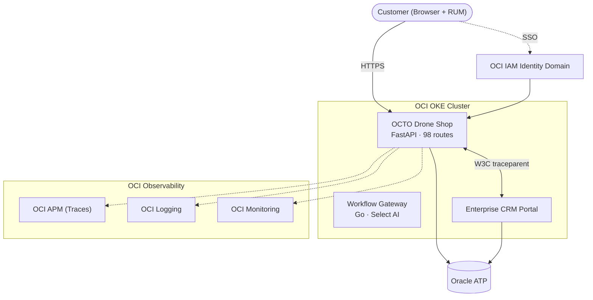

# OCTO Drone Shop

**Cloud-native e-commerce platform with full OCI observability, IDCS SSO, cross-service CRM integration, and automated remediation.**

[:octicons-mark-github-16: View on GitHub](https://github.com/adibirzu/octo-drone-shop){ .md-button .md-button--primary }
[:material-rocket-launch: Live Demo](https://shop.octodemo.cloud){ .md-button }

---

## What is OCTO Drone Shop?

OCTO Drone Shop is an **ATP-backed drone commerce platform** purpose-built to demonstrate how Oracle Cloud Infrastructure's observability, security, and AI services integrate with cloud-native applications running on OKE.

It serves as both a **working e-commerce demo** and a **reference architecture** for customers deploying enterprise workloads on Oracle Cloud Infrastructure.

<div class="grid cards" markdown>

-   :material-telescope:{ .lg .middle } **Full MELTS Observability**

    ---

    Metrics, Events, Logs, Traces, and Security — all correlated through OCI APM, Logging, Monitoring, and Log Analytics.

    [:octicons-arrow-right-24: Observability](observability/index.md)

-   :material-shield-check:{ .lg .middle } **Security-First Design**

    ---

    19 MITRE ATT&CK security span types, WAF protection rules, OCI Cloud Guard, Vault integration, and PII masking.

    [:octicons-arrow-right-24: Security](observability/security.md)

-   :material-puzzle:{ .lg .middle } **Framework Architecture**

    ---

    Modular design with 13 independent modules. Add new features without breaking existing capabilities.

    [:octicons-arrow-right-24: Framework](architecture/framework.md)

-   :material-connection:{ .lg .middle } **Cross-Service Integration**

    ---

    W3C traceparent-propagated distributed traces between Drone Shop, CRM Portal, and shared Oracle ATP.

    [:octicons-arrow-right-24: Integrations](integrations/index.md)

</div>

## Architecture at a Glance



## Key Capabilities

| Capability | Details |
|---|---|
| **Application** | 98 API routes, 13 modules, FastAPI + Go workflow gateway |
| **Database** | Oracle ATP with session tagging, DB Management, Operations Insights |
| **Authentication** | IDCS OIDC + PKCE with JWKS-verified RS256 ID tokens |
| **Observability** | 50+ OpenTelemetry spans, Prometheus metrics, OCI Monitoring custom metrics |
| **Security** | WAF, Cloud Guard, Security Zones, Vault, 19 MITRE ATT&CK security types |
| **Testing** | 237 Playwright E2E tests, 3 k6 load test suites |
| **Deployment** | Tenancy-portable OKE manifests, single `DNS_DOMAIN` variable |
| **Resilience** | Circuit breakers, chaos engineering, OCI Health Checks, 5 alarms |

## Tenancy Portability

Set **one variable** and everything derives:

```bash
export DNS_DOMAIN="yourcompany.cloud"
# → shop.yourcompany.cloud (shop URL, CORS, SSO callback)
# → crm.yourcompany.cloud (CRM URL, customer sync)
# → All IDCS redirect URIs auto-derived
```

No tenancy OCIDs, regions, or hostnames are hardcoded in the codebase.

## OCI-DEMO Component

**Component ID: C28** — Drone Shop Portal (OKE)

Part of the OCI-DEMO ecosystem alongside Enterprise CRM Portal (C27), Ops Portal, and OCI Coordinator with Remediation Agent v2.
