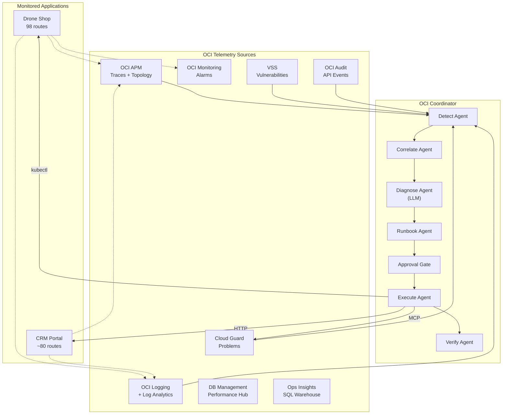

# OCI Coordinator Integration

The OCI Coordinator's Remediation Agent v2 consumes telemetry from both services and executes automated remediations via MCP tools.

## Admin Surface and Scope Guard

For the `emdemo` OCTO deployment, the interactive Coordinator is exposed only
inside the CRM Admin page:

| Surface | Route | Guard |
|---|---|---|
| `admin.octodemo.cloud` | `/admin` UI panel | CRM admin session required |
| CRM API | `POST /api/admin/coordinator/query` | CRM admin session + admin host required |
| CRM API | `GET /api/admin/coordinator/scope` | CRM admin session + admin host required |

The Coordinator is not rendered in the drone shop storefront, global CRM
navigation, or non-admin pages. The API rejects non-admin hosts and refuses
questions that ask for generic tenancy, unrelated domains, unrelated projects,
or all-compartment/all-resource inventory.

Allowed answer scope is limited to OCTO APM Demo resources and admin pages:

- `admin.octodemo.cloud` CRM admin, users, sessions, audit logs, and runtime config.
- `drones.octodemo.cloud` shop dependency, catalog sync, payment simulation, and order sync.
- OCTO ATP (`octoatp_low`), SQL_ID enrichment, Select AI/admin DB workflows.
- OCI APM, RUM, OCI Logging, Log Analytics, security detections, and workflow traces for this project.
- OCTO Demo Langfuse telemetry (`lf.octodemo.cloud` / `langfuse.octodemo.cloud`) only when tied to the drones project data.

Coordinator decisions are visible in APM and logs through:

| Field | Purpose |
|---|---|
| `admin.coordinator.query` | Span for each admin question |
| `admin.coordinator.scope` | Span for scope metadata reads |
| `coordinator.surface` | Always `admin` |
| `coordinator.host` | Request host that reached the endpoint |
| `coordinator.scope` | Always `octo-apm-demo` |
| `coordinator.allowed` | Whether the question was answered |
| `coordinator.topic` | Matched admin/OCTO topic |
| `coordinator.refusal_reason` | Reason when a question is refused |

## Architecture



## Telemetry Signals Consumed

| Signal | Source | Coordinator Use |
|---|---|---|
| **Cloud Guard Problems** | `cloudguard_list_problems` | Primary security alert feed |
| **Security Score** | `cloudguard_get_security_score` | Posture assessment |
| **VSS Vulnerabilities** | `vss_list_host_scans` | Container/host vuln detection |
| **Audit Events** | `audit_list_events` | Suspicious API activity |
| **APM Traces** | OCI APM API | Error rate, latency correlation |
| **App Logs** | Log Analytics (`oracleApmTraceId`) | Root cause analysis |
| **Custom Metrics** | OCI Monitoring | Alarm triggers |
| **DB Performance** | DB Management / OPSI | SQL root cause |

## OCTO DEMO OKE Coordinator Readiness

May 11, 2026 `emdemo` status:

| Capability | Current State | Notes |
|---|---|---|
| Ask the live websites | Ready | `drones.octodemo.cloud` and `admin.octodemo.cloud` `/ready` return HTTP 200 through the preserved OCI Load Balancer. |
| Ask OCI APM | Ready from app side | Shop/CRM emit OTel traces, RUM is configured, and the Java APM sidecar is enabled on the Shop VM. |
| Ask OCI Logging | Ready | Fresh app records carry `oracleApmTraceId`, `trace_id`, route, status, service, DB target, and deployment metadata. |
| Ask Log Analytics | Partially blocked | The Log Analytics namespace/log group exist, but no OCTO app source/parser rows are present because Service Connector Hub quota is exhausted for new routes. |
| Install Coordinator on OKE | Blocked on target cluster | Existing OKE clusters are in the quickstart VCN; no ACTIVE OKE cluster exists in the OCTO project VCN yet. |

For an OKE-hosted Coordinator, use instance principal or workload identity for
OCI API authentication and keep the dynamic group/policy scoped to the OCTO
DEMO compartment. The minimum read path is:

- read APM domains and traces for the OCTO APM domain
- read Logging log groups/logs for the OCTO app log group
- read Log Analytics queries once the OCTO source/parser/connector path is
  active
- read Monitoring alarms and metrics for the OCTO namespaces
- read OKE cluster/node/pod state for the selected same-VCN cluster

Until Log Analytics routing is unblocked, Coordinator question answering should
prefer OCI Logging queries by `oracleApmTraceId` and use Log Analytics only for
shared/non-OCTO sources that are already routed.

Example Coordinator questions that are supported once deployed:

| Question | Required data |
|---|---|
| "Which user login led to this order?" | APM trace, app logs, `auth.user_id`, order fields, DB audit rows |
| "Why did this checkout fail?" | `payment.gateway.request_id`, payment simulation spans/logs, order payment state |
| "What backend calls made this page slow?" | APM trace spans, DB span attributes, Workflow Gateway spans |
| "Which guardrail blocked this request?" | security span/log fields and checkout security saved searches |
| "Did this incident reach the database?" | `trace_id`/`oracleApmTraceId` plus DB statement/sql-id span attributes |

## Remediation Actions

### Infrastructure (via kubectl MCP)

| Action | Command | When |
|---|---|---|
| Stop service | `kubectl scale --replicas=0` | Service compromised |
| Restart service | `kubectl rollout restart` | Memory leak, stale state |
| Scale up | `kubectl scale --replicas=N` | High load detected |
| Scale down | `kubectl scale --replicas=1` | Load subsided |

### Application (via HTTP)

| Action | Endpoint | When |
|---|---|---|
| Inject CPU stress | `POST /api/simulate/configure {"cpu_spike": true}` | Stress testing |
| Inject DB latency | `POST /api/simulate/db-latency {"delay_seconds": N}` | Resilience testing |
| Generate load | `POST /api/simulate/generate-orders {"count": N}` | Load testing |
| Stop chaos | `POST /api/simulate/reset` | After investigation |
| Force order sync | `POST /api/orders/sync` | Sync backlog resolution |
| Error burst | `POST /api/simulate/error-burst {"count": N}` | Alert testing |

### Security (via MCP tools)

| Action | MCP Tool | When |
|---|---|---|
| Resolve problem | `cloudguard_remediate_problem(id, RESOLVE)` | After fix confirmed |
| Dismiss false positive | `cloudguard_remediate_problem(id, DISMISS)` | False positive confirmed |
| Kill bastion session | `bastion_terminate_session(id)` | Unauthorized access |

## Coordinator Workflow

```
1. DETECT  → Scan Cloud Guard, VSS, Audit, APM for anomalies
2. CORRELATE → Match findings to APM traces and Log Analytics entries
3. DIAGNOSE → LLM analyzes root cause from correlated telemetry
4. RUNBOOK → Generate structured remediation steps
5. APPROVE → Human-in-the-loop gate (or auto-approve in sandbox)
6. EXECUTE → Run fix via kubectl, HTTP, or MCP tool
7. VERIFY → Re-scan to confirm remediation success
```

## Console Drilldown URLs

Both services expose drilldown URLs for the coordinator to link findings to OCI Console:

| Service | Endpoint | Returns |
|---|---|---|
| Shop | `/api/observability/360` → `pillars` | APM, Logging, OPSI, DB Management URLs |
| CRM | `/api/integrations/topology` → `drilldown_products` | APM, Log Analytics, OPSI, DB Management URLs |

## Demo Scenario: CPU Spike → Detection → Remediation

```bash
# 1. Coordinator triggers stress test via CRM proxy
POST /api/simulate/configure {"cpu_spike": true}

# 2. OCI Monitoring alarm fires (app.errors.rate > threshold)
# 3. Cloud Guard detects unusual activity
# 4. Coordinator DETECT agent picks up the signals
# 5. CORRELATE links alarm → APM traces → Log Analytics
# 6. DIAGNOSE identifies cpu_spike simulation flag
# 7. RUNBOOK generates: "Reset simulation state"
# 8. APPROVE (human confirms)
# 9. EXECUTE: POST /api/simulate/reset
# 10. VERIFY: re-check /health → healthy
```
