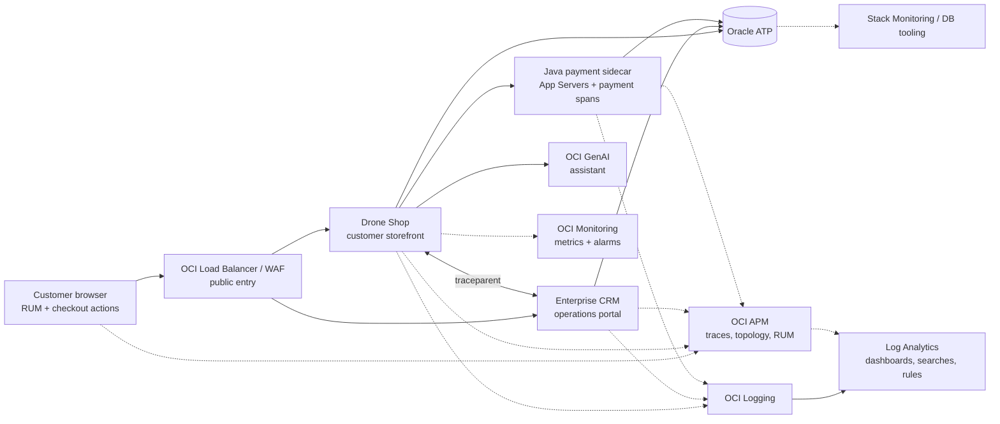

# Observability v2

OCTO APM Demo is a reusable demo project that showcases OCI Observability
service capabilities across a realistic commerce workflow: browser RUM,
distributed APM traces, structured logs, Log Analytics dashboards, SQL
drill-downs, custom metrics, security signals, and guided remediation.

The current documentation covers two active runtime targets: a private
VM/Compute reference runtime and an OKE runtime that can run the same Shop,
CRM, Java sidecar, ATP, APM, Logging, and Log Analytics signal contract. Public
docs intentionally use placeholder hostnames and variables; do not publish live
public IP addresses, private IP addresses, OCIDs, tenancy/profile names, secret
paths, or operator allowlists.

## Current Signal Path



## What Changed

| Area | Current capability |
|---|---|
| Customer checkout | Browser actions, Shop spans, token-safe payment gateway telemetry, Java sidecar payment spans, CRM order sync, and ATP SQL visibility share the same trace context. |
| Java App Servers | The Java sidecar populates OCI APM App Servers while also participating in the checkout trace through `payment.verify` and `payment.authorize` calls. |
| APM saved queries | Repo-owned descriptors cover checkout, payment sidecar, slow DB spans, login, assistant LLMetry, service errors, platform workflows, and one-trace drill-down. |
| Log Analytics | Parsers, fields, saved searches, dashboards, and seven scheduled-search-safe rules are versioned with reusable variables: five workshop threat rules plus two OKE operations rules. |
| MELTS coverage | Shop and Admin expose `/api/observability/melts` with the expected metrics, events, logs, traces, and synthetics contract for fast pre-demo validation. |
| Custom OCI metrics | Shop and Admin publish low-cardinality app metrics to OCI Monitoring namespace `octo_apm_demo`, including request/error rates, checkout/order counts, auth outcomes, security events, dashboard loads, DB latency, and inventory health. |
| Assistant LLMetry | OCI GenAI assistant requests emit prompt/response hashes, token usage, session ids, and optional Langfuse comparison fields without logging prompt secrets. |
| Admin AI operations | OCI Coordinator, Query Lab, and Select AI stay on the Admin surface with OCTO scope guardrails, instance-principal auth metadata, APM spans, and Log Analytics pivots. |
| Guided event generation | The Admin Simulation Lab now explains which APM spans, RUM actions, logs, Log Analytics searches, and evidence keys each demo button generates. |
| Captured Data Center | Operators can open `/captured-data` to build APM Trace Explorer and Log Analytics pivots from Trace ID, Order ID, Payment Gateway Request ID, Attack ID, or Assistant Session ID. |
| Public docs | Architecture diagrams and docs are sanitized and should remain free of live IPs, OCIDs, credentials, and local-only operator data. |

## Correlation Contract

Every user-visible journey carries shared identifiers so the demo can pivot
between OCI services without relying on screenshots or manual timestamps:

| Signal | Join fields |
|---|---|
| RUM to APM | `trace_id`, page action, session, route |
| APM to logs | `TraceId` / `trace_id` / `oracleApmTraceId` |
| Logs to Log Analytics | `Trace ID`, `Span ID`, `Request ID`, `Workflow ID` |
| Checkout to payment rail | `Order ID`, `Payment Gateway Request ID`, `Transaction ID`, response code |
| Assistant to LLMetry | `Assistant Session ID`, `Application Hash`, `gen_ai.*` fields |
| SQL to traces | `DbOracleSqlId`, sanitized statement metadata, ATP service name |

Payment records are token-safe. The demo keeps raw PAN, CVV, wallet token
payloads, cryptograms, customer email, and secrets out of traces, logs, and
dashboards.

## Demo Workflows

1. **Event generation loop** — open the Admin Simulation Lab, run Demo
   Storyboard, Synthetic Users, Attack Lab, Java Health, or payment
   decline/timeout, then copy the returned evidence keys into the Captured Data
   Center.
2. **Checkout end to end** — start in a browser session, place an order, open
   the APM checkout saved query, then pivot to Log Analytics using the
   copyable `Trace ID`, `Order ID`, `Payment Gateway Request ID`, payment
   components, gateway steps, and security-triage search shown on the checkout
   evidence panel.
3. **Payment rail drill-down** — inspect the Java sidecar spans for wallet,
   3-D Secure, processor, network authorization, and simulated decline paths.
4. **Slow SQL investigation** — use APM DB spans and the Log Analytics
   `db-slowness-hotspots` / `trace-drilldown` searches to move from user
   impact to database evidence.
5. **Assistant LLMetry** — compare assistant spans, OCI GenAI usage fields,
   Log Analytics rows, ATP `llmetry_events`, and optional Langfuse export.
6. **Security and attack lab** — follow WAF/API Gateway, application, OSQuery,
   and Cloud Guard pivots through the Log Analytics command-center searches.

## MELTS Readiness

Before a live workshop, verify both apps expose their signal contract:

```bash
curl -fsS https://shop.example.test/api/observability/melts | jq
curl -fsS https://admin.example.test/api/observability/melts | jq
```

Then run the Log Analytics saved search
`melts-collection-completeness.sql`. It checks the three ingestion paths used by
the demo: structured application logs, connector-fed OCI Unified Schema rows,
and OKE Kubernetes container logs. Healthy output should show recent samples,
trace/span correlation, workflow ids, order ids, and payment gateway request
ids for the active Shop, Admin, and Java payment components.

## Pages

- [Golden workflows](workflows.md)
- [Event generation guide](event-generation-guide.md)
- [Chaos playbook (CRM-only)](chaos-playbook.md)
- [Log Analytics dashboards](log-analytics-dashboards.md)
- [APM drill-down](apm-drilldown.md)
- [Synthetic monitoring](synthetic-monitoring.md)
- [Drone assistant LLMetry](../drone-shop/assistant.md)
- [Demo Storyboard and Attack Lab](demo-storyboard-attack-lab.md)
- [Auto-remediation flow](autoremediation-flow.md)
- [Security + WAF observability](waf-observability.md)
- [Demo script](demo-script.md) with [end-user PDF guide](../assets/demo/octo-end-user-demo-guide.pdf)

## Apply Assets

Use variables for tenancy-specific values:

```bash
OCI_CLI_PROFILE=<OCI_PROFILE> \
COMPARTMENT_ID=<COMPARTMENT_OCID> \
APM_DOMAIN_ID=<APM_DOMAIN_OCID> \
./deploy/oci/apm/apply_saved_queries.sh --dry-run

OCI_CLI_PROFILE=<OCI_PROFILE> \
COMPARTMENT_ID=<COMPARTMENT_OCID> \
LA_NAMESPACE=<LA_NAMESPACE> \
./deploy/oci/log_analytics/apply_saved_searches_and_dashboards.py
```

Run with `--apply` only after the dry run is clean and the target compartment
has the required OCI permissions.
