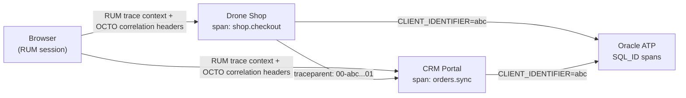

# Cross-Service Distributed Tracing

Backend services propagate W3C `traceparent` headers on service-to-service
calls. Browser JavaScript does not synthesize `traceparent`; it sends
`X-Correlation-Id`, `X-OCTO-Journey-Id`, and checkout/user-action headers, and
OCI APM RUM is the browser-side source of trace context. This avoids backend
spans being attached to a parent span that was never exported.

## Trace Flow



## Trace Correlation Keys

| Header/Field | Propagated By | Visible In |
|---|---|---|
| `traceparent` | W3C standard (RUM + HTTPXClientInstrumentor) | APM Trace Explorer |
| `X-Trace-Id` | Response header | Frontend correlation |
| `X-Span-Id` | Response header | Frontend correlation |
| `X-Correlation-Id` | Custom header (both services) | APM + Logs |
| `oracleApmTraceId` | Log field | OCI Log Analytics |
| `CLIENT_IDENTIFIER` | Oracle session tag | V$SESSION → OPSI |
| `DbOracleSqlId` | Span attribute | APM → DB Management |

## Python OTEL Coverage

All Python FastAPI entry points use `FastAPIInstrumentor.instrument_app()` with
OCTO request hooks, health/static exclusions, and sanitized header capture.
The same OTLP conventions are used by CLI/worker scripts so they appear in the
same OCI APM domain:

| Service/script | Service name |
|---|---|
| Drone Shop FastAPI | `octo-drone-shop` / `octo-drone-shop-oke` |
| Enterprise CRM FastAPI | `enterprise-crm-portal` / `enterprise-crm-portal-oke` |
| Traffic generator | `octo-traffic-generator` |
| Load control API | `octo-load-control` |
| Async worker | `octo-async-worker` |
| Remediator API | `octo-remediator` |
| Object pipeline API | `octo-object-pipeline` |
| Edge fuzz command | `octo-edge-fuzz` |
| Auto-remediator OCI Function | `octo-auto-remediator` |

For direct OCI APM export, set `OCI_APM_ENDPOINT` and
`OCI_APM_PRIVATE_DATAKEY`; for OKE collector mode, set
`OTEL_EXPORTER_OTLP_ENDPOINT=http://gateway.octo-otel.svc.cluster.local:4318`.
Both forms normalize to the proper OTLP trace endpoint.

## APM Topology

When both services run, OCI APM Topology shows the full service graph:

```
Browser (RUM) → Drone Shop → Oracle ATP
                    ├──→ Enterprise CRM → Oracle ATP
                    └──→ IDCS (SSO login spans)
```

Each edge represents real distributed traces. Click an edge to see individual spans crossing that boundary.

## Cross-Service Scenarios

### 1. Checkout with CRM Sync

```
Browser → shop.checkout
  ├── db.query: INSERT orders (shop ATP)
  ├── db.query: INSERT order_items (shop ATP)
  ├── db.query: INSERT shipments (shop ATP)
  ├── payment_gateway.emulator.authorize
  │    ├── java_app_server.post.api.java-apm.payment.verify
  │    └── java_app_server.post.api.java-apm.payment.authorize
  └── integration.crm.sync_order
       ├── HTTP POST crm/api/orders (traceparent injected)
       └── CRM: orders.create
            ├── db.query: SELECT customer (CRM ATP — same instance)
            └── db.query: INSERT order (CRM ATP)
```

The Java payment spans add token-safe wallet/card attributes and events
for Google Pay, Apple Pay, Visa, and Mastercard rails. The shared
`payment.gateway.request_id` joins Browser RUM, Shop spans, Java spans,
`payment_gateway_events`, CRM order state, and Log Analytics rows.

### 2. Customer Sync

```
Shop storefront load → integration.crm.sync_customers
  ├── HTTP GET crm/api/customers (traceparent injected)
  └── CRM: customers.list
       └── db.query: SELECT customers (shared ATP)
Shop: db.query: UPSERT customers (shared ATP)
```

### 3. Simulation Proxy

```
CRM: simulation.drone_shop_proxy
  ├── HTTP POST shop/api/simulate/* (X-Internal-Service-Key)
  └── Shop: simulation.set
       └── ChaosMiddleware state updated
```

### 4. CRM Login and Admin Coordinator

```
Browser RUM action: auth.login.submit
  └── CRM: auth.login
       ├── db.user_lookup
       ├── auth.password_verify
       └── INSERT user_sessions

Browser RUM action: ui.click / admin coordinator
  └── CRM: admin.coordinator.query
       ├── coordinator.scope=octo-apm-demo
       └── structured log: coordinator.allowed / coordinator.topic
```

## Verification in OCI Console

1. **APM** → Trace Explorer → filter `serviceName=octo-drone-shop`
2. Pick a trace with `integration.crm.*` spans
3. See the full distributed trace spanning both services
4. **APM** → Topology → verify edges: Shop ↔ CRM ↔ ATP
5. Click a SQL span → `DbOracleSqlId` → jump to DB Management Performance Hub
6. **Log Analytics** → search `oracleApmTraceId=<trace_id>` → see logs from BOTH services

## Saved Queries

Use the versioned APM saved queries in `deploy/oci/apm/saved-queries/` as the
starting point for common investigations:

| issue | APM query | Log Analytics query |
|---|---|---|
| Checkout/order/payment failure | `checkout-end-to-end` | `checkout-payment-correlation` |
| Java payment rail issue | `payment-java-sidecar` | `checkout-payment-correlation` or `service-error-triage` |
| Login/session issue | `login-auth-flow` | `auth-login-correlation` |
| Assistant/Select AI/GenAI issue | `assistant-genai-llmetry` | `genai-assistant-llmetry` |
| Slow DB call | `db-slow-spans` | `db-slowness-hotspots` |
| Unknown app error | `service-errors` | `service-error-triage` |
| One copied trace id | `trace-drilldown` | `trace-drilldown` |
