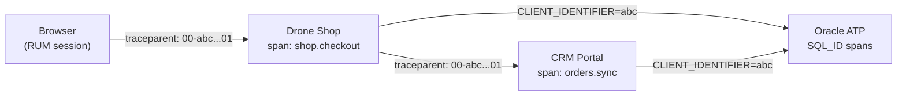

# Cross-Service Distributed Tracing

Both services propagate W3C `traceparent` headers on every cross-service call, creating distributed traces visible in OCI APM Topology.

## Trace Flow



## Trace Correlation Keys

| Header/Field | Propagated By | Visible In |
|---|---|---|
| `traceparent` | W3C standard (HTTPXClientInstrumentor) | APM Trace Explorer |
| `X-Trace-Id` | Response header | Frontend correlation |
| `X-Span-Id` | Response header | Frontend correlation |
| `X-Correlation-Id` | Custom header (both services) | APM + Logs |
| `oracleApmTraceId` | Log field | OCI Log Analytics |
| `CLIENT_IDENTIFIER` | Oracle session tag | V$SESSION → OPSI |
| `DbOracleSqlId` | Span attribute | APM → DB Management |

## APM Topology

When both services run, OCI APM Topology shows the full service graph:

```
Browser (RUM) → Drone Shop → Oracle ATP
                    ├──→ Enterprise CRM → Oracle ATP
                    └──→ IDCS (SSO login spans)
```

Each edge represents real distributed traces. Click an edge to see individual spans crossing that boundary.

## Cross-Service Scenarios

### 1. Checkout with CRM Sync

```
Browser → shop.checkout
  ├── db.query: INSERT orders (shop ATP)
  ├── db.query: INSERT order_items (shop ATP)
  ├── db.query: INSERT shipments (shop ATP)
  └── integration.crm.sync_order
       ├── HTTP POST crm/api/orders (traceparent injected)
       └── CRM: orders.create
            ├── db.query: SELECT customer (CRM ATP — same instance)
            └── db.query: INSERT order (CRM ATP)
```

### 2. Customer Sync

```
Shop storefront load → integration.crm.sync_customers
  ├── HTTP GET crm/api/customers (traceparent injected)
  └── CRM: customers.list
       └── db.query: SELECT customers (shared ATP)
Shop: db.query: UPSERT customers (shared ATP)
```

### 3. Simulation Proxy

```
CRM: simulation.drone_shop_proxy
  ├── HTTP POST shop/api/simulate/* (X-Internal-Service-Key)
  └── Shop: simulation.set
       └── ChaosMiddleware state updated
```

## Verification in OCI Console

1. **APM** → Trace Explorer → filter `serviceName=octo-drone-shop-oke`
2. Pick a trace with `integration.crm.*` spans
3. See the full distributed trace spanning both services
4. **APM** → Topology → verify edges: Shop ↔ CRM ↔ ATP
5. Click a SQL span → `DbOracleSqlId` → jump to DB Management Performance Hub
6. **Log Analytics** → search `oracleApmTraceId=<trace_id>` → see logs from BOTH services
