# OCI Observability Onboarding Workshop

A hands-on workshop that teaches how to operate the full OCI Observability
stack — APM, APM RUM, Logging, Log Analytics, Monitoring, Stack Monitoring,
and Cloud Guard — using `octo-apm-demo` as the playground. **Ten labs**,
~6 hours total if done in one sitting; designed to be split across two
half-days.

!!! tip "How to use this workshop"
    Every page in the workshop section has a **Configure your deployment**
    panel just below the title (look for the ⚙ icon). Expand it once,
    enter your DNS domain, compartment OCID, and OCIR region, and every
    code block on every page rewrites itself with your real values.

    Values stay in your browser only — they are never sent to any server.
    Click **Reset to placeholders** to clear them.

## Who this is for

Engineers, SREs, and platform operators who:

- Know their way around a terminal and a browser dev console.
- Have access to an OCI tenancy with `octo-apm-demo` deployed (or are
  ready to deploy it in ~30 minutes following one of the
  [Getting Started](../getting-started/index.md) guides).
- Want to learn the OCI Observability surface end-to-end: not just one
  service in isolation, but how traces, logs, metrics, and events
  correlate through `oracleApmTraceId`, W3C trace context, and a shared
  service-identity contract.

## What you'll be able to do at the end

By the end of the ten labs you'll be able to:

1. **Find any HTTP request's full distributed trace** across browser
   (APM RUM), edge (load balancer + WAF), application (FastAPI Python +
   Java sidecar), and database (Oracle ATP) — in under 30 seconds, starting
   from a user complaint.
2. **Pivot from a Log Analytics record to its APM trace** and back, using
   `oracleApmTraceId` as the bridge.
3. **Build a Log Analytics saved search** and pin it to a dashboard widget.
4. **Author an OCI Monitoring alarm** with a useful annotation contract
   (no "your CPU is high" alerts; alerts that actually point at the trace
   to investigate).
5. **Drill from an ATP wait event** (Stack Monitoring) to the source SQL
   to the trace that emitted it.
6. **Investigate a WAF event** and decide if it was a real attack or a
   noisy scanner — using request body, source IP intelligence, and the
   downstream application response.
7. **Run a chaos drill**, observe what breaks, and resolve it without
   losing your audit trail.
8. **Diagnose a failed checkout** end-to-end: customer report
   ("checkout didn't work") → trace → log → SQL → fix.

## Workshop format

Each lab follows the same shape so you can scan ahead and plan:

| Section | What it does |
|---|---|
| **Objective** | One sentence — what you'll learn. |
| **Time budget** | Honest estimate (we tracked our own runs). |
| **Prerequisites** | Specific OCI policies, env access, prior labs. |
| **Steps** | OCI Console + CLI walkthroughs in parallel — pick whichever you prefer. |
| **What you should see** | Screenshots and example outputs. If your screen looks different, the troubleshooting section probably covers it. |
| **Verify** | A `tools/workshop/verify-NN.sh` script you run; exit 0 = lab complete. |
| **Troubleshooting** | The three most common things that go sideways. |
| **Read more** | Underlying docs, OCI service references, related code paths. |

## The 10 labs

| # | Lab | Time | Pre-reqs |
|---|---|---|---|
| 01 | [Your first trace](lab-01-first-trace.md) | 20 min | platform deployed |
| 02 | [Trace ↔ Log correlation](lab-02-trace-log-correlation.md) | 30 min | lab 01 |
| 03 | [Find a slow SQL from an APM span](lab-03-slow-sql-drill-down.md) | 30 min | lab 02 |
| 04 | [Detecting a frontend outage from RUM](lab-04-rum-outage-detection.md) | 25 min | lab 01 |
| 05 | [Custom metric + alarm](lab-05-metric-and-alarm.md) | 40 min | lab 01 |
| 06 | [WAF event investigation](lab-06-waf-event-investigation.md) | 30 min | lab 01 |
| 07 | [Build a Log Analytics saved search](lab-07-saved-search.md) | 35 min | lab 02 |
| 08 | [Stack Monitoring + ATP health](lab-08-stack-monitoring-atp.md) | 40 min | lab 03 |
| 09 | [Chaos drill](lab-09-chaos-drill.md) | 50 min | labs 01-05 |
| 10 | [End-to-end debug a failed checkout](lab-10-failed-checkout.md) | 60 min | all prior labs |

**Total:** ~6 hours. **Recommended split:** labs 1-5 day one (~2.5h),
labs 6-10 day two (~3.5h).

---

## Prerequisites checklist

The labs assume your environment is already set up. Work through this
checklist before lab 01 — most issues that look like "the lab is broken"
turn out to be missing prerequisites.

### 1. Octo APM Demo deployed in your tenancy

Either deployment path is fine:

=== "Unified VM"

    A single OCI Compute VM running shop + CRM + Java sidecar + Workflow
    Gateway as Podman containers, behind a public Load Balancer with WAF.

    Follow the [new-tenancy guide](../getting-started/new-tenancy.md).
    Typical first-time deploy: 30-45 minutes.

=== "OKE (Kubernetes)"

    Two-node OKE cluster with Helm-deployed services. Best for production
    parity testing.

    Follow the [OKE deployment guide](../getting-started/oke-deployment.md).
    Typical first-time deploy: 45-60 minutes (cluster provisioning is the
    long part).

=== "Compute Resource Manager Stack"

    OCI-native Infrastructure-as-Code via Resource Manager. One-click
    deploy, suitable for repeatable demo provisioning.

    Follow the [Compute deployment guide](../getting-started/compute-deployment.md).
    Typical first-time deploy: 25-40 minutes.

### 2. Local tooling on your laptop

You need a recent Bash shell, curl, jq, and the OCI CLI. Quick verification:

```bash
oci --version           # 3.40 or newer
kubectl version --client --short
jq --version
curl --version
bash --version          # macOS users: `brew install bash` for 5.x
```

If any are missing, see the [Prerequisites page](../getting-started/prerequisites.md)
for install instructions per platform.

### 3. OCI permissions

You need **Read** policies on:

- APM domains (`Allow group <your-group> to read apm-domains in compartment <COMPARTMENT_OCID>`)
- Log groups + Log Analytics namespace
- Monitoring metrics
- Stack Monitoring resources
- WAF policies in the demo's compartment

The platform's [`deploy/oci/policies/`](https://github.com/<github-username>/octo-apm-demo/tree/main/deploy/oci/policies)
includes a workshop-reader policy template.

### 4. Optional: traffic generator

Strongly recommended. Without it, APM and RUM will show empty trace
explorers — making it hard to follow the labs.

Deploy the synthetic traffic generator from
[`tools/traffic-generator/`](https://github.com/<github-username>/octo-apm-demo/tree/main/tools/traffic-generator).

It runs a low-rate (~1 transaction/minute) loop: opens the storefront,
adds a drone to the cart, checks out, and refreshes admin views. Enough
signal to make every lab interactive without spamming your tenancy.

### 5. Platform reachability check

The single most important pre-flight check. **Run this before any lab.**
Replace the placeholders with your real values (or use the config panel
above — it rewrites these commands as you type):

```bash
# Storefront reachability (replace example.com with your DNS_DOMAIN)
curl -sS https://drones.example.com/ready | jq

# Admin reachability
curl -sS https://admin.example.com/ready | jq
```

**Expected output for each (production OCI deployment):**

```json
{
  "ready": true,
  "database": "connected",
  "apm_configured": true,
  "rum_configured": true,
  "logging_configured": true,
  "java_apm_enabled": true,
  "payment_gateway_simulation_enabled": true
}
```

**What it looks like on a local docker-compose stack** (no OCI tenancy
attached — useful for first-time exploration):

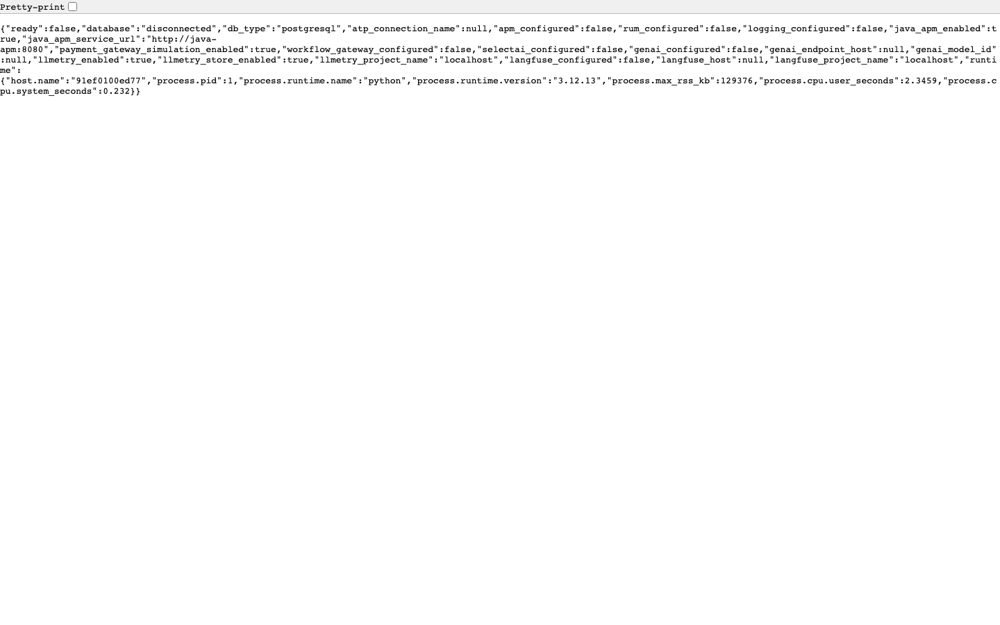

In the local case, `apm_configured`/`rum_configured`/`logging_configured`
all return `false` because there's no OCI tenancy attached — that's
expected for local exploration. For an OCI deployment, every field
should return `true`.

If any field is `false` on an OCI deployment, see the
[Deploy Readiness](../operations/deploy-readiness.md) page — it has a
per-field troubleshooting matrix.

### What the storefront looks like locally

Once `/ready` returns 200, point a browser at `http://localhost:18080`
(local stack) or `https://drones.example.com` (your OCI deployment). The
storefront landing page summarizes the demo signals:

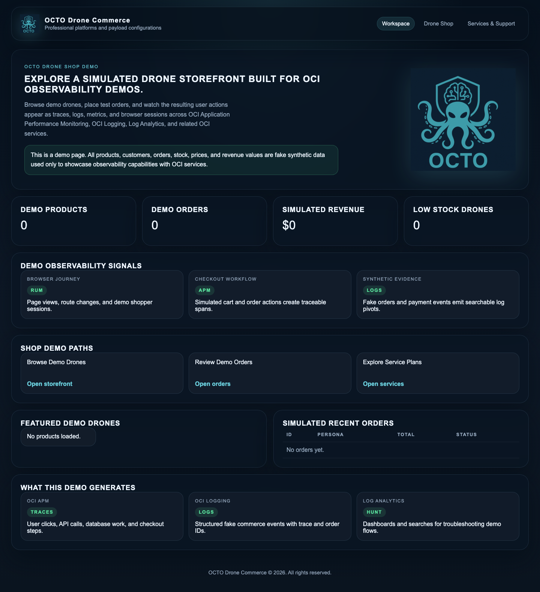

The page is intentionally minimal at first — synthetic data appears after
the traffic generator has been running for a few minutes (orders,
revenue, observability events).

### Explore the platform locally before lab 01

Spend ten minutes clicking through the storefront paths to build intuition.
What you'll find:

=== "Drone catalog (`/shop`)"

    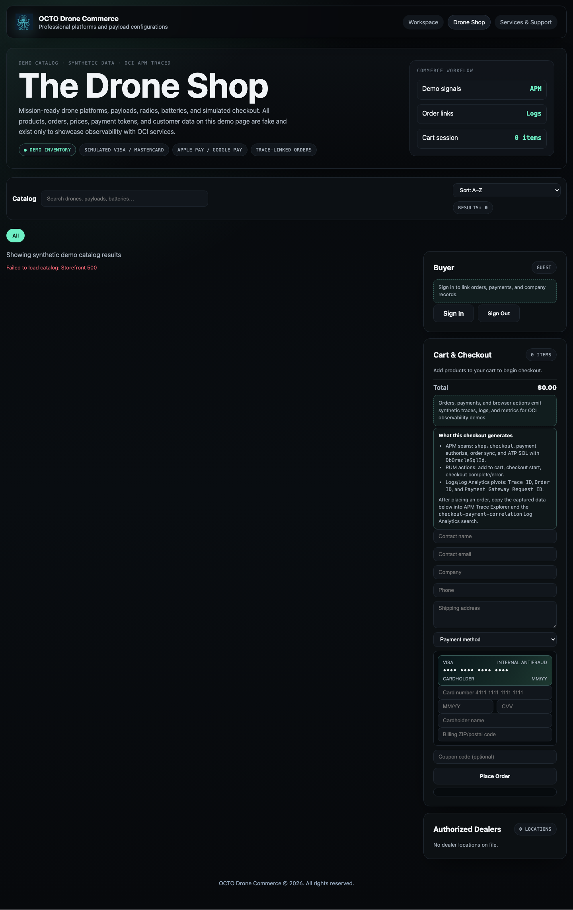

    The product listing. Every product card click emits a RUM custom
    action — useful for lab 04. The traffic generator targets these
    routes to fill APM Trace Explorer.

=== "Login (`/login`)"

    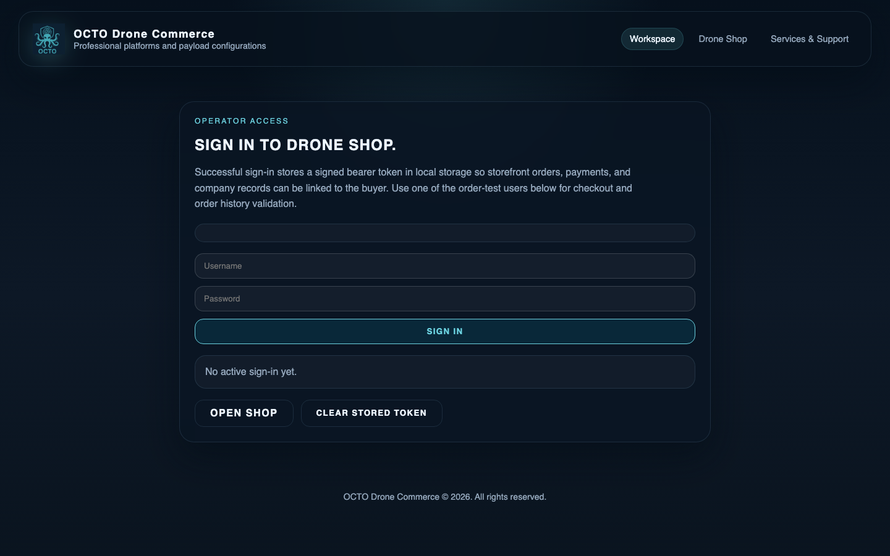

    Customer authentication. Successful sign-in emits a structured log
    record + an APM custom event with `service.name=octo-drone-shop` and
    `auth.outcome=success` — referenced in lab 02 and lab 10.

=== "Orders (`/orders-page`)"

    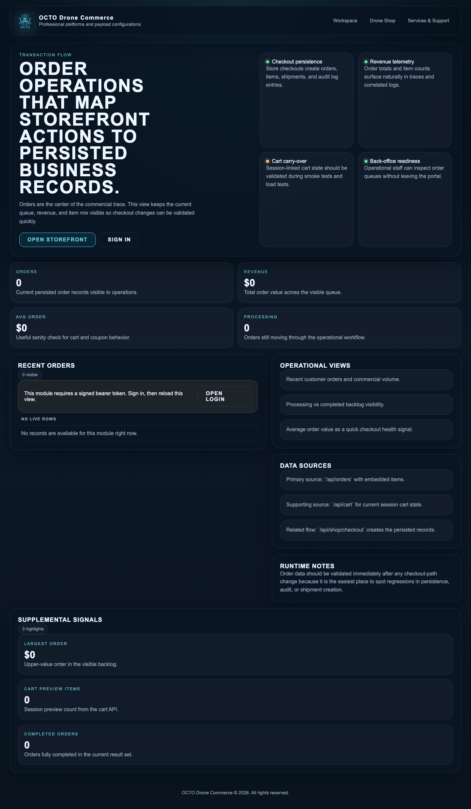

    Cross-service order state — populated after CRM sync. The screenshot
    is empty here because the local stack starts cold; production
    deployments show signed-in users' recent orders.

=== "Observability dashboard (`/observability`)"

    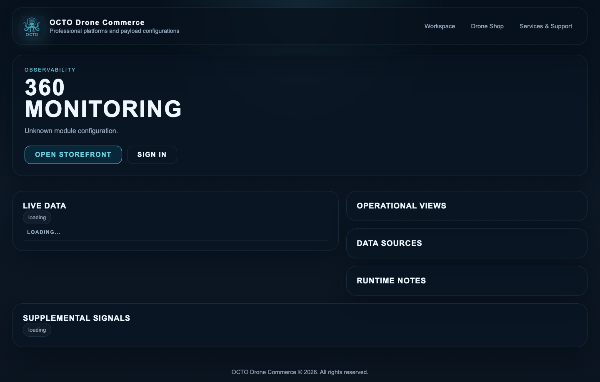

    The 360° platform health view — live data, operational views, data
    sources, supplemental signals. Each panel maps to a specific APM
    trace pattern or Log Analytics saved search.

=== "Admin (`/admin-page`)"

    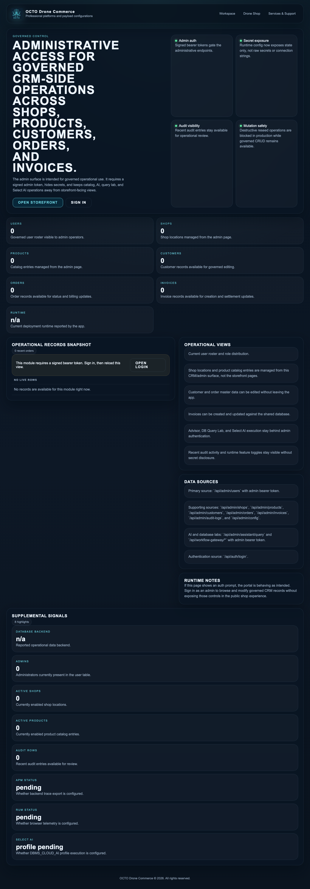

    Admin operational records — orders, products, customers, shipments.
    Admin actions emit a separate audit log stream. Lab 09 (chaos drill)
    uses this surface.

=== "Java sidecar (`:18091/actuator`)"

    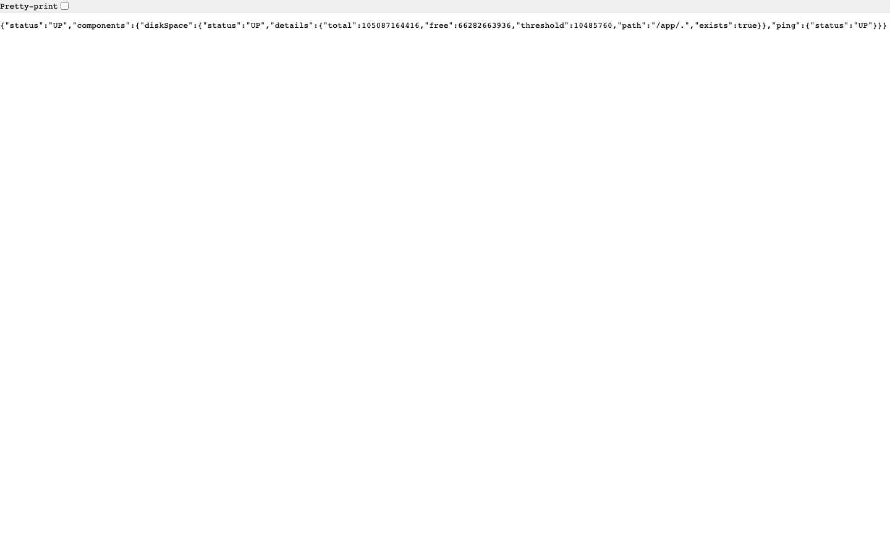

    The Spring Boot payment sidecar exposes `/actuator/health`,
    `/actuator/info`, and `/actuator/metrics`. OCI Stack Monitoring polls
    these endpoints in production — lab 08 covers it.

### What it looks like in OCI Observability

When the same storefront runs against a real OCI tenancy, the
observability surface lights up. Examples (tenancy chips redacted):

=== "APM Trace Explorer"

    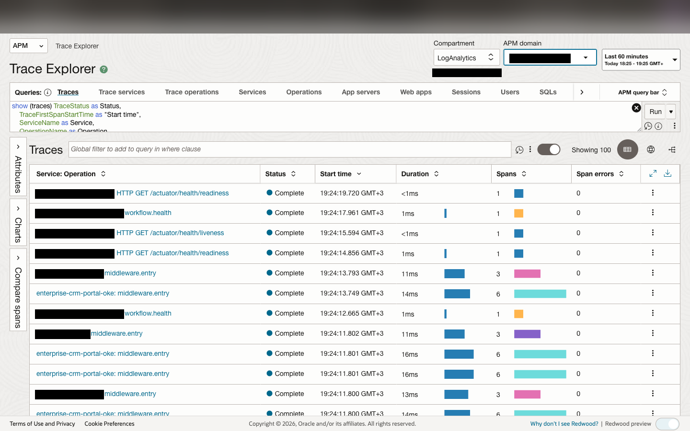

    Every storefront request appears as a trace. Filter by service,
    operation, status, latency. Each row drills into a flame chart.

=== "Flame chart"

    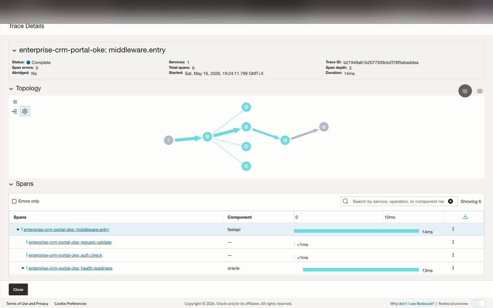

    Parent FastAPI server span with nested SQLAlchemy / Java sidecar
    children. Span widths show their share of total wall-clock time.

=== "Span attributes"

    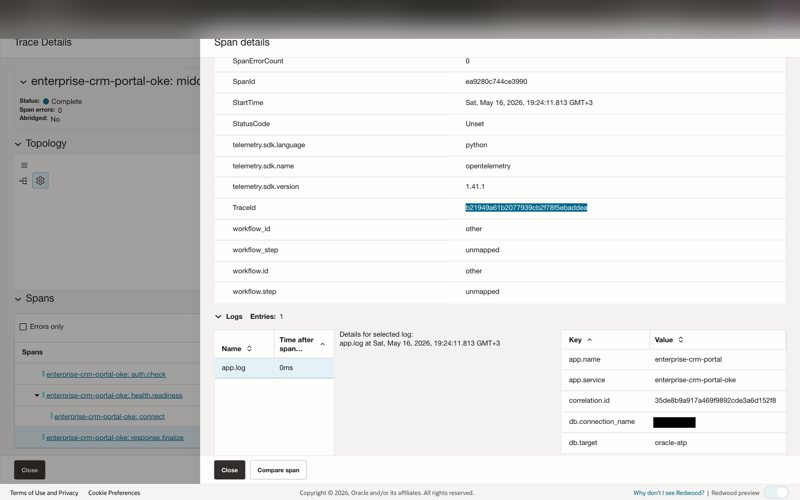

    Right-hand panel reveals `service.name`, `http.route`,
    `oracleApmTraceId` and the rest of the correlation contract.

=== "APM Operations"

    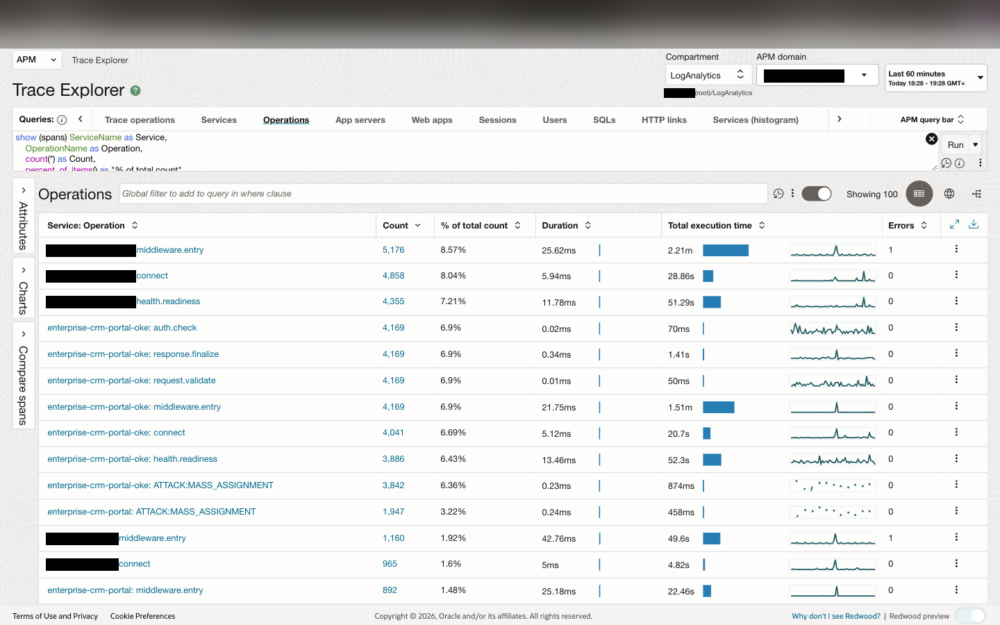

    Service-level operations roll-up: per-route latency, throughput,
    error rate. Useful for spotting regression in a specific endpoint.

=== "APM RUM"

    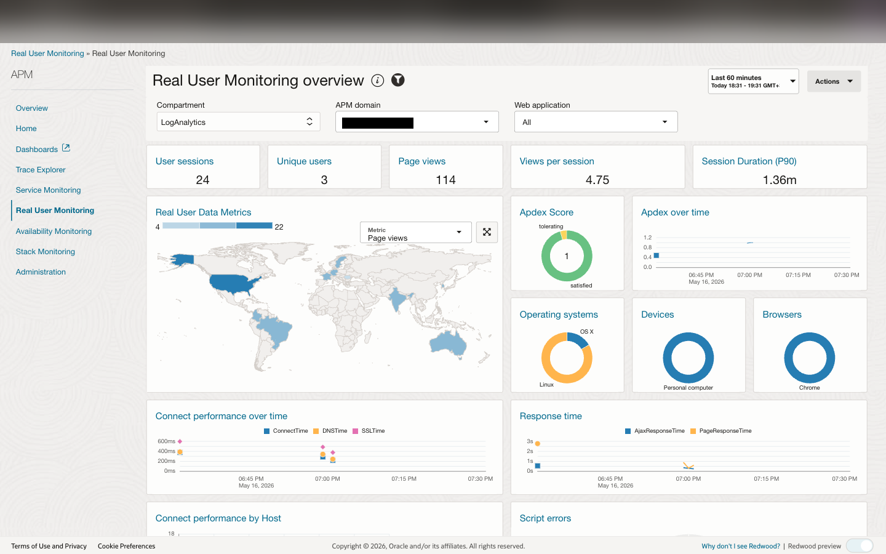

    Real User Monitoring for the browser side: page loads, custom
    actions, geographic distribution, Apdex, response time, error rate.
    Sessions propagate W3C trace context into the FastAPI server spans.

=== "Log Analytics — Detection Rules"

    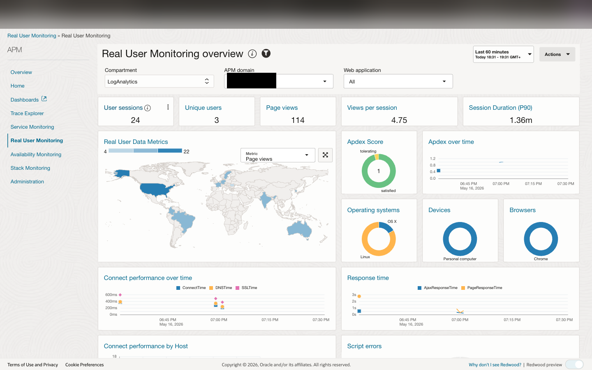

    Project-shipped detection rules (auth anomalies, payment-rail
    patterns, attack-lab signatures). Each rule has its metric and
    dimension contract documented in the architecture.

---

## Workshop conventions

- **Shell**: every snippet assumes `bash` (not zsh-specific syntax). On
  macOS, `bash` from Homebrew works fine.
- **Hostnames**: every URL uses placeholder hostnames like
  `drones.example.com` / `admin.example.com`. If your tenancy uses a
  different `DNS_DOMAIN`, enter it in the config panel above and every
  command on this page rewrites automatically. Tokens substituted:
  `example.com`, `example.test`, `example.tld`, `${DNS_DOMAIN}`,
  `<COMPARTMENT_OCID>`, `<TENANCY_NAMESPACE>`, `<OCIR_REGION>`,
  `<OCIR_TENANCY>`, `<github-username>`, `<DEPLOYMENT_PREFIX>`.
- **OCI Console paths**: instructions show menu paths like
  *Observability & Management → Application Performance Monitoring →
  Trace Explorer*. Path is identical across regions; only the region
  selector at the top differs.
- **Log Analytics source names**: older snippets may mention the legacy
  `octo-shop-app-json` source. In current deployments:
    - Direct/OKE app rows use `SOC Application Logs`
    - Connector Hub rows from OCI Logging use `OCI Unified Schema Logs`
      and should be checked with `connector-live-log-coverage.sql`.
- **Verify markers**: code blocks marked `# verify` are the snippets the
  `tools/workshop/verify-*.sh` scripts execute on your behalf.

## Certification

After lab 10, run:

```bash
./tools/workshop/certify.sh
```

It re-runs every per-lab verifier in sequence and prints a passport
showing which labs you completed. Save the output — it's evidence you
can attach to internal training records or PR descriptions.

## Troubleshooting common setup issues

??? warning "`/ready` returns 502 from the LB"
    The application pod/container is up but not responding. Check:

    - **VM path**: `ssh opc@<vm> sudo podman ps` — all containers should
      show `(healthy)`. If `octo-drone-shop` is restarting, check
      `sudo podman logs --tail 50 octo-drone-shop` for ATP wallet load
      errors or missing env vars.
    - **OKE path**: `kubectl get pods -n octo-drone-shop` — all should
      be `Running 1/1 Ready`. Common cause: missing `octo-atp-wallet`
      secret. See the [Deployment Options](../getting-started/deployment-options.md)
      page for the secret bootstrap commands.

??? warning "APM Trace Explorer is empty"
    No traces being emitted. Check:

    1. Is the traffic generator running? `kubectl get pods -n octo-traffic-generator`
       or `sudo systemctl status octo-traffic-generator`
    2. Are the APM env vars set?
       ```bash
       curl -sS https://drones.example.com/ready | jq '.apm'
       ```
       Should show `configured: true`. If `false`: missing
       `OCI_APM_ENDPOINT` or `OCI_APM_PRIVATE_DATAKEY` — see the
       project-level `docs/CONFIGURATION.md` for the full variable list.
    3. Are you looking in the right APM domain? The domain OCID is in
       your deployment's `OCI_APM_ENDPOINT`.

??? warning "Log Analytics shows zero rows"
    Logs not flowing through. Three possibilities:

    1. **Service Connector Hub quota exhausted** — common. Check
       *OCI Console → Observability & Management → Service Connector Hub*.
       If `available=0`, you need to free a connector or request a quota
       increase.
    2. **Connector not yet processing the new log group** — connectors
       have a 1-2 minute warm-up.
    3. **Parser not extracting** — run the `connector-live-log-coverage.sql`
       saved search; if it returns rows, the connector is fine and the
       parser is the issue.

??? warning "RUM dashboard says 'No data'"
    Check:

    1. Is the `OCI_APM_WEB_APPLICATION` env var pointing to the right
       Web Application OCID?
    2. Did you hard-reload the storefront after deploy? The RUM script
       loads on page load; cached pages won't emit beacons.
    3. Are browser ad blockers / DevTools network filters interfering?
       Look in DevTools Network panel for requests to
       `*.apm-agt.<region>.oci.oraclecloud.com`.

## License

Same MIT license as the rest of the repo. Fork, adapt, ship for your own
tenancy. Pull requests welcome — especially new labs covering OCI
services we haven't reached yet (API Gateway, Functions, Streaming,
Database Management).
